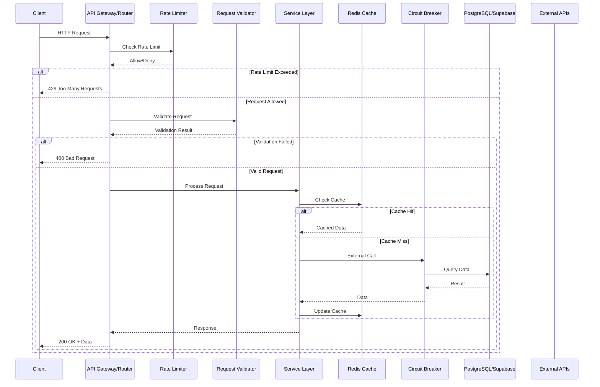
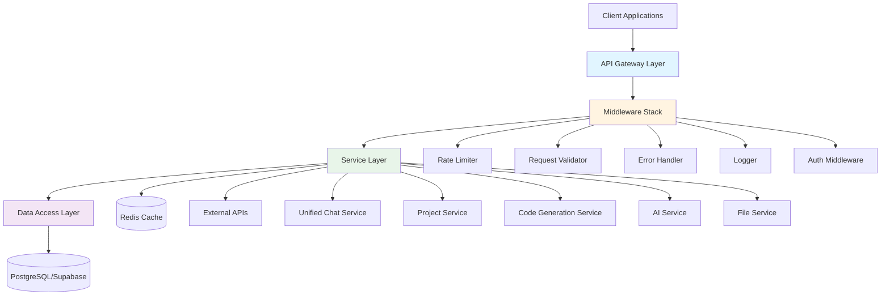

# Design Document: Backend Services Improvement

## Overview

This design addresses critical architectural issues in the STEM Project Generator backend services by implementing a modern, scalable service layer architecture. The current system suffers from service duplication (3 chat services), inconsistent error handling, lack of caching strategy, and tight coupling. This comprehensive redesign consolidates services, implements proper abstraction layers, adds Redis-based caching, rate limiting, circuit breakers, and standardizes error handling across all services while maintaining backward compatibility with the existing frontend.

## Main Algorithm/Workflow



## Architecture

### High-Level Architecture



### Service Consolidation Strategy

**Before (14 Services):**
- chat_service.py
- enhanced_chat_service.py
- universal_chat_service.py
- project_context_service.py
- enhanced_project_context_service.py
- ai_guidance_service.py
- stateless_ai_guidance_service.py
- software_project_planning_service.py
- enhanced_software_planning_service.py
- code_generation_service.py
- file_management_service.py
- streaming_service.py
- technology_stack_service.py
- project_change_detector.py

**After (14 Unified Services):**

**Phase 1: Core Consolidation (7 Services)**
- unified_chat_service.py (consolidates 3 chat services)
- project_service.py (consolidates 3 project services)
- ai_service.py (consolidates 2 AI services)
- code_generation_service.py (enhanced with streaming)
- file_service.py (file management)
- technology_service.py (technology stacks)
- monitoring_service.py (health checks, metrics)

**Phase 2: AI Production Enhancements (7 New Services)**
- ai_orchestrator.py (unified AI entry point, coordinates all AI operations)
- model_router.py (smart model selection by task type for 70% cost reduction)
- prompt_service.py (centralized prompt template management from files)
- context_builder.py (build personalized context from user profile and history)
- task_queue_service.py (Redis + RQ for non-blocking AI requests)
- tool_system.py (AI agent tool registration and execution framework)
- experiment_logger.py (track AI metrics, prompt performance, user ratings)


## Components and Interfaces

### Component 1: Service Layer Base

**Purpose**: Provide common functionality for all services including dependency injection, caching, logging, and error handling

**Interface**:
```python
from abc import ABC, abstractmethod
from typing import Optional, Dict, Any, TypeVar, Generic
from datetime import timedelta

T = TypeVar('T')

class BaseService(ABC, Generic[T]):
    """Base service class with common functionality"""
    
    def __init__(
        self,
        cache: Optional['CacheManager'] = None,
        logger: Optional['StructuredLogger'] = None,
        db_client: Optional['DatabaseClient'] = None
    ):
        self.cache = cache
        self.logger = logger
        self.db = db_client
    
    async def get_cached_or_fetch(
        self,
        cache_key: str,
        fetch_func: callable,
        ttl: timedelta = timedelta(hours=1)
    ) -> T:
        """Get data from cache or fetch and cache it"""
        pass
    
    async def invalidate_cache(self, pattern: str) -> int:
        """Invalidate cache entries matching pattern"""
        pass
    
    @abstractmethod
    async def health_check(self) -> Dict[str, Any]:
        """Service-specific health check"""
        pass

class ServiceRegistry:
    """Service registry for dependency injection"""
    
    def __init__(self):
        self._services: Dict[str, BaseService] = {}
    
    def register(self, name: str, service: BaseService) -> None:
        """Register a service"""
        pass
    
    def get(self, name: str) -> BaseService:
        """Get a registered service"""
        pass
    
    def get_all_services(self) -> Dict[str, BaseService]:
        """Get all registered services"""
        pass
```

**Responsibilities**:
- Provide dependency injection container
- Implement common caching patterns
- Standardize logging across services
- Handle common error scenarios
- Provide health check interface


### Component 2: Unified Chat Service

**Purpose**: Consolidate all chat functionality into a single, cohesive service

**Interface**:
```python
from enum import Enum
from typing import List, Optional, Dict, Any
from datetime import datetime

class ChatContext(Enum):
    PROJECT = "project"
    UNIVERSAL = "universal"
    CODE_GENERATION = "code_generation"

class UnifiedChatService(BaseService):
    """Unified chat service consolidating all chat functionality"""
    
    async def create_session(
        self,
        user_id: str,
        context: ChatContext,
        context_id: Optional[str] = None,
        metadata: Optional[Dict[str, Any]] = None
    ) -> ChatSession:
        """Create a new chat session with context"""
        pass
    
    async def send_message(
        self,
        session_id: str,
        content: str,
        sender: MessageSender,
        metadata: Optional[Dict[str, Any]] = None
    ) -> ChatMessage:
        """Send a message in a chat session"""
        pass
    
    async def get_history(
        self,
        session_id: str,
        limit: int = 50,
        offset: int = 0,
        include_context: bool = True
    ) -> List[ChatMessage]:
        """Get chat history with optional context"""
        pass
    
    async def detect_intent(
        self,
        message: str,
        context: ChatContext
    ) -> IntentDetectionResult:
        """Detect user intent from message"""
        pass
    
    async def get_conversation_context(
        self,
        session_id: str,
        window_size: int = 10
    ) -> ConversationContext:
        """Get conversation context for AI continuity"""
        pass
    
    async def archive_session(
        self,
        session_id: str,
        user_id: str
    ) -> bool:
        """Archive a chat session"""
        pass
```

**Responsibilities**:
- Manage chat sessions across all contexts (project, universal, code generation)
- Handle message storage and retrieval
- Detect user intents (code generation, questions, modifications)
- Maintain conversation context for AI
- Support voice transcription metadata
- Implement session lifecycle management


### Component 3: Cache Manager

**Purpose**: Provide unified caching layer with Redis backend

**Interface**:
```python
from typing import Optional, Any, List
from datetime import timedelta
from enum import Enum

class CacheStrategy(Enum):
    WRITE_THROUGH = "write_through"
    WRITE_BEHIND = "write_behind"
    CACHE_ASIDE = "cache_aside"

class CacheManager:
    """Redis-based cache manager with multiple strategies"""
    
    def __init__(
        self,
        redis_client: 'Redis',
        default_ttl: timedelta = timedelta(hours=1),
        strategy: CacheStrategy = CacheStrategy.CACHE_ASIDE
    ):
        self.redis = redis_client
        self.default_ttl = default_ttl
        self.strategy = strategy
    
    async def get(
        self,
        key: str,
        deserializer: Optional[callable] = None
    ) -> Optional[Any]:
        """Get value from cache"""
        pass
    
    async def set(
        self,
        key: str,
        value: Any,
        ttl: Optional[timedelta] = None,
        serializer: Optional[callable] = None
    ) -> bool:
        """Set value in cache"""
        pass
    
    async def delete(self, key: str) -> bool:
        """Delete key from cache"""
        pass
    
    async def delete_pattern(self, pattern: str) -> int:
        """Delete all keys matching pattern"""
        pass
    
    async def get_or_set(
        self,
        key: str,
        fetch_func: callable,
        ttl: Optional[timedelta] = None
    ) -> Any:
        """Get from cache or fetch and cache"""
        pass
    
    async def invalidate_tags(self, tags: List[str]) -> int:
        """Invalidate all cache entries with given tags"""
        pass
    
    async def get_stats(self) -> Dict[str, Any]:
        """Get cache statistics"""
        pass
```

**Responsibilities**:
- Manage Redis connections and connection pooling
- Implement cache-aside, write-through, and write-behind strategies
- Handle serialization/deserialization
- Support cache invalidation by pattern and tags
- Provide cache statistics and monitoring
- Handle cache failures gracefully


### Component 4: Rate Limiter

**Purpose**: Protect API endpoints from abuse and ensure fair resource usage

**Interface**:
```python
from enum import Enum
from typing import Optional, Dict, Any
from datetime import timedelta

class RateLimitStrategy(Enum):
    FIXED_WINDOW = "fixed_window"
    SLIDING_WINDOW = "sliding_window"
    TOKEN_BUCKET = "token_bucket"
    LEAKY_BUCKET = "leaky_bucket"

class RateLimiter:
    """Redis-based rate limiter with multiple strategies"""
    
    def __init__(
        self,
        redis_client: 'Redis',
        strategy: RateLimitStrategy = RateLimitStrategy.SLIDING_WINDOW
    ):
        self.redis = redis_client
        self.strategy = strategy
    
    async def check_rate_limit(
        self,
        identifier: str,
        limit: int,
        window: timedelta,
        cost: int = 1
    ) -> RateLimitResult:
        """Check if request is within rate limit"""
        pass
    
    async def get_remaining(
        self,
        identifier: str,
        limit: int,
        window: timedelta
    ) -> int:
        """Get remaining requests in current window"""
        pass
    
    async def reset(self, identifier: str) -> bool:
        """Reset rate limit for identifier"""
        pass
    
    async def get_stats(self, identifier: str) -> Dict[str, Any]:
        """Get rate limit statistics"""
        pass

class RateLimitResult:
    """Result of rate limit check"""
    allowed: bool
    remaining: int
    reset_at: datetime
    retry_after: Optional[int]
```

**Responsibilities**:
- Implement multiple rate limiting algorithms
- Support per-user, per-IP, and per-endpoint limits
- Provide rate limit headers (X-RateLimit-*)
- Handle distributed rate limiting across multiple servers
- Support burst allowances
- Provide rate limit statistics


### Component 5: Circuit Breaker

**Purpose**: Prevent cascading failures when external services are unavailable

**Interface**:
```python
from enum import Enum
from typing import Optional, Callable, Any
from datetime import timedelta

class CircuitState(Enum):
    CLOSED = "closed"
    OPEN = "open"
    HALF_OPEN = "half_open"

class CircuitBreaker:
    """Circuit breaker for external service calls"""
    
    def __init__(
        self,
        failure_threshold: int = 5,
        success_threshold: int = 2,
        timeout: timedelta = timedelta(seconds=60),
        half_open_timeout: timedelta = timedelta(seconds=30)
    ):
        self.failure_threshold = failure_threshold
        self.success_threshold = success_threshold
        self.timeout = timeout
        self.half_open_timeout = half_open_timeout
        self.state = CircuitState.CLOSED
    
    async def call(
        self,
        func: Callable,
        *args,
        fallback: Optional[Callable] = None,
        **kwargs
    ) -> Any:
        """Execute function with circuit breaker protection"""
        pass
    
    async def get_state(self) -> CircuitState:
        """Get current circuit state"""
        pass
    
    async def reset(self) -> None:
        """Manually reset circuit breaker"""
        pass
    
    async def get_metrics(self) -> Dict[str, Any]:
        """Get circuit breaker metrics"""
        pass

class CircuitBreakerRegistry:
    """Registry for managing multiple circuit breakers"""
    
    def __init__(self):
        self._breakers: Dict[str, CircuitBreaker] = {}
    
    def get_breaker(
        self,
        name: str,
        **config
    ) -> CircuitBreaker:
        """Get or create circuit breaker"""
        pass
    
    async def get_all_states(self) -> Dict[str, CircuitState]:
        """Get states of all circuit breakers"""
        pass
```

**Responsibilities**:
- Monitor external service call failures
- Open circuit after threshold failures
- Implement half-open state for recovery testing
- Provide fallback mechanisms
- Track failure/success metrics
- Support manual circuit reset


### Component 6: Request Validator

**Purpose**: Centralized request validation with Pydantic models

**Interface**:
```python
from pydantic import BaseModel, validator, Field
from typing import Optional, List, Dict, Any
from enum import Enum

class ValidationError(Exception):
    """Custom validation error"""
    def __init__(self, errors: List[Dict[str, Any]]):
        self.errors = errors

class RequestValidator:
    """Centralized request validation"""
    
    @staticmethod
    def validate(
        data: Dict[str, Any],
        model: type[BaseModel]
    ) -> BaseModel:
        """Validate request data against Pydantic model"""
        pass
    
    @staticmethod
    def validate_partial(
        data: Dict[str, Any],
        model: type[BaseModel],
        fields: List[str]
    ) -> BaseModel:
        """Validate only specified fields"""
        pass
    
    @staticmethod
    def sanitize_input(data: str) -> str:
        """Sanitize user input"""
        pass
    
    @staticmethod
    def validate_pagination(
        limit: int,
        offset: int,
        max_limit: int = 100
    ) -> tuple[int, int]:
        """Validate pagination parameters"""
        pass

# Example validation models
class ChatMessageRequest(BaseModel):
    session_id: str = Field(..., min_length=1, max_length=100)
    content: str = Field(..., min_length=1, max_length=10000)
    metadata: Optional[Dict[str, Any]] = None
    
    @validator('content')
    def validate_content(cls, v):
        if not v.strip():
            raise ValueError('Content cannot be empty')
        return v.strip()

class ProjectCreateRequest(BaseModel):
    title: str = Field(..., min_length=1, max_length=200)
    description: str = Field(..., min_length=1, max_length=5000)
    project_type: str
    difficulty: str
    user_id: str
    
    @validator('project_type')
    def validate_project_type(cls, v):
        allowed = ['iot', 'robotics', 'web', 'mobile', 'general']
        if v not in allowed:
            raise ValueError(f'Invalid project type. Must be one of {allowed}')
        return v
```

**Responsibilities**:
- Validate all incoming requests
- Sanitize user input
- Provide clear validation error messages
- Support partial validation for PATCH requests
- Validate pagination parameters
- Prevent injection attacks


### Component 7: Error Handler

**Purpose**: Standardize error responses across all endpoints

**Interface**:
```python
from enum import Enum
from typing import Optional, Dict, Any, List
from fastapi import HTTPException, Request
from fastapi.responses import JSONResponse

class ErrorCode(Enum):
    # Client errors (4xx)
    VALIDATION_ERROR = "VALIDATION_ERROR"
    AUTHENTICATION_ERROR = "AUTHENTICATION_ERROR"
    AUTHORIZATION_ERROR = "AUTHORIZATION_ERROR"
    NOT_FOUND = "NOT_FOUND"
    RATE_LIMIT_EXCEEDED = "RATE_LIMIT_EXCEEDED"
    INVALID_REQUEST = "INVALID_REQUEST"
    
    # Server errors (5xx)
    INTERNAL_ERROR = "INTERNAL_ERROR"
    SERVICE_UNAVAILABLE = "SERVICE_UNAVAILABLE"
    DATABASE_ERROR = "DATABASE_ERROR"
    EXTERNAL_API_ERROR = "EXTERNAL_API_ERROR"
    CACHE_ERROR = "CACHE_ERROR"

class APIError(Exception):
    """Base API error"""
    def __init__(
        self,
        code: ErrorCode,
        message: str,
        details: Optional[Dict[str, Any]] = None,
        status_code: int = 500
    ):
        self.code = code
        self.message = message
        self.details = details or {}
        self.status_code = status_code

class ErrorHandler:
    """Centralized error handling"""
    
    @staticmethod
    def handle_exception(
        request: Request,
        exc: Exception
    ) -> JSONResponse:
        """Handle any exception and return standardized response"""
        pass
    
    @staticmethod
    def create_error_response(
        code: ErrorCode,
        message: str,
        details: Optional[Dict[str, Any]] = None,
        status_code: int = 500
    ) -> JSONResponse:
        """Create standardized error response"""
        pass
    
    @staticmethod
    def log_error(
        error: Exception,
        context: Dict[str, Any]
    ) -> None:
        """Log error with context"""
        pass

# Standard error response format
class ErrorResponse(BaseModel):
    error: str  # Error code
    message: str  # Human-readable message
    details: Optional[Dict[str, Any]] = None  # Additional details
    timestamp: datetime
    request_id: Optional[str] = None
    path: Optional[str] = None
```

**Responsibilities**:
- Catch and handle all exceptions
- Provide standardized error responses
- Log errors with context
- Include request IDs for tracing
- Sanitize error messages (no sensitive data)
- Support error code mapping


### Component 8: AI Orchestrator

**Purpose**: Unified entry point for all AI operations, coordinating model selection, prompts, caching, fallbacks, tools, and streaming

**Interface**:
```python
from enum import Enum
from typing import Optional, Dict, Any, AsyncIterator
from datetime import timedelta

class TaskType(Enum):
    SIMPLE_QUESTION = "simple_question"
    CODE_GENERATION = "code_generation"
    CODE_EXPLANATION = "code_explanation"
    PROJECT_PLANNING = "project_planning"
    COMPLEX_REASONING = "complex_reasoning"

class AIOrchestrator(BaseService):
    """Unified AI orchestration service"""
    
    def __init__(
        self,
        model_router: 'ModelRouter',
        prompt_service: 'PromptService',
        context_builder: 'ContextBuilder',
        task_queue: 'TaskQueueService',
        tool_system: 'ToolSystem',
        experiment_logger: 'ExperimentLogger',
        cache: 'CacheManager'
    ):
        self.model_router = model_router
        self.prompt_service = prompt_service
        self.context_builder = context_builder
        self.task_queue = task_queue
        self.tool_system = tool_system
        self.experiment_logger = experiment_logger
        self.cache = cache
    
    async def generate(
        self,
        task_type: TaskType,
        user_input: str,
        user_id: str,
        context: Optional[Dict[str, Any]] = None,
        stream: bool = False,
        use_tools: bool = False,
        background: bool = False
    ) -> Union[str, AsyncIterator[str], str]:
        """Generate AI response with full orchestration"""
        pass
    
    async def generate_with_cache(
        self,
        prompt_hash: str,
        generate_func: callable,
        ttl: timedelta = timedelta(hours=1)
    ) -> str:
        """Generate with prompt hash-based caching"""
        pass
    
    async def stream_response(
        self,
        model: str,
        prompt: str,
        tools: Optional[List[Dict]] = None
    ) -> AsyncIterator[str]:
        """Stream AI response token by token"""
        pass

class AIRequest(BaseModel):
    """AI request model"""
    task_type: TaskType
    user_input: str
    user_id: str
    context: Optional[Dict[str, Any]] = None
    stream: bool = False
    use_tools: bool = False
    background: bool = False

class AIResponse(BaseModel):
    """AI response model"""
    content: str
    model_used: str
    tokens_used: int
    latency_ms: float
    cached: bool
    tools_used: List[str] = []
```

**Responsibilities**:
- Route requests to appropriate FREE model based on task type
- Load and format prompts from template files
- Build personalized context for each request
- Check cache before generating (prompt hash-based)
- Handle streaming responses token by token
- Execute tool calls if AI requests them
- Log all requests for experiment tracking
- Queue long-running requests for background processing
- Handle fallbacks to other free models on failures


### Component 9: Model Router

**Purpose**: Smart model selection by task type to optimize cost and performance

**Interface**:
```python
from enum import Enum
from typing import Optional, List

class ModelTier(Enum):
    FAST = "fast"  # GPT-3.5, Claude Instant
    BALANCED = "balanced"  # GPT-4-turbo
    POWERFUL = "powerful"  # GPT-4, Claude Opus

class ModelRouter:
    """Smart model selection for cost optimization"""
    
    def __init__(
        self,
        model_config: Dict[TaskType, ModelTier],
        fallback_chain: Dict[str, List[str]]
    ):
        self.model_config = model_config
        self.fallback_chain = fallback_chain
    
    def select_model(
        self,
        task_type: TaskType,
        user_tier: str = "free"
    ) -> str:
        """Select optimal model for task type and user tier"""
        pass
    
    def get_fallback_models(
        self,
        primary_model: str
    ) -> List[str]:
        """Get fallback models if primary fails"""
        pass
    
    def estimate_cost(
        self,
        model: str,
        input_tokens: int,
        output_tokens: int
    ) -> float:
        """Estimate cost for model and token count"""
        pass

class ModelTier(Enum):
    FAST = "fast"  # Free models: google/gemini-flash-1.5, meta-llama/llama-3.2-3b-instruct:free
    BALANCED = "balanced"  # Free models: google/gemini-pro-1.5, meta-llama/llama-3.1-8b-instruct:free
    POWERFUL = "powerful"  # Free models: google/gemini-pro-1.5-exp, qwen/qwen-2.5-72b-instruct:free

class ModelRouter:
    """Smart model selection for cost optimization"""
    
    def __init__(
        self,
        model_config: Dict[TaskType, ModelTier],
        fallback_chain: Dict[str, List[str]]
    ):
        self.model_config = model_config
        self.fallback_chain = fallback_chain
    
    def select_model(
        self,
        task_type: TaskType,
        user_tier: str = "free"
    ) -> str:
        """Select optimal model for task type and user tier"""
        pass
    
    def get_fallback_models(
        self,
        primary_model: str
    ) -> List[str]:
        """Get fallback models if primary fails"""
        pass
    
    def estimate_cost(
        self,
        model: str,
        input_tokens: int,
        output_tokens: int
    ) -> float:
        """Estimate cost for model and token count (always $0 for free models)"""
        pass

# Default model routing configuration (FREE MODELS ONLY)
DEFAULT_MODEL_ROUTING = {
    TaskType.SIMPLE_QUESTION: ModelTier.FAST,  # gemini-flash-1.5
    TaskType.CODE_EXPLANATION: ModelTier.FAST,  # gemini-flash-1.5
    TaskType.CODE_GENERATION: ModelTier.BALANCED,  # gemini-pro-1.5
    TaskType.PROJECT_PLANNING: ModelTier.BALANCED,  # gemini-pro-1.5
    TaskType.COMPLEX_REASONING: ModelTier.POWERFUL  # qwen-2.5-72b or gemini-pro-1.5-exp
}

# Fallback chain for reliability (ALL FREE MODELS)
FALLBACK_CHAIN = {
    "google/gemini-pro-1.5-exp": ["google/gemini-pro-1.5", "google/gemini-flash-1.5"],
    "qwen/qwen-2.5-72b-instruct:free": ["google/gemini-pro-1.5", "meta-llama/llama-3.1-8b-instruct:free"],
    "google/gemini-pro-1.5": ["google/gemini-flash-1.5", "meta-llama/llama-3.1-8b-instruct:free"],
    "google/gemini-flash-1.5": ["meta-llama/llama-3.2-3b-instruct:free"],
    "meta-llama/llama-3.1-8b-instruct:free": ["google/gemini-flash-1.5"]
}
```

**Responsibilities**:
- Map task types to optimal FREE model tiers
- Select best free model that meets quality requirements
- Provide fallback free models for reliability
- Track model performance (all models are $0 cost)
- Support different free models for different task complexities
- Maximize quality while staying 100% free


### Component 10: Prompt Service

**Purpose**: Centralized prompt template management from files for easy iteration and A/B testing

**Interface**:
```python
from pathlib import Path
from typing import Dict, Any, Optional

class PromptService:
    """Manage prompt templates from files"""
    
    def __init__(
        self,
        prompts_dir: Path = Path("backend/prompts")
    ):
        self.prompts_dir = prompts_dir
        self._cache: Dict[str, str] = {}
    
    def load_prompt(
        self,
        prompt_name: str,
        version: str = "latest"
    ) -> str:
        """Load prompt template from file"""
        pass
    
    def format_prompt(
        self,
        template: str,
        variables: Dict[str, Any]
    ) -> str:
        """Format prompt template with variables"""
        pass
    
    def get_prompt(
        self,
        prompt_name: str,
        variables: Dict[str, Any],
        version: str = "latest"
    ) -> str:
        """Load and format prompt in one call"""
        pass
    
    def list_prompts(self) -> List[str]:
        """List all available prompt templates"""
        pass
    
    def reload_prompts(self) -> None:
        """Reload all prompts from disk (for hot-reload)"""
        pass

# Example prompt file structure:
# backend/prompts/
#   code_generation_v1.txt
#   code_generation_v2.txt
#   project_planning.txt
#   simple_question.txt
#   code_explanation.txt
```

**Responsibilities**:
- Load prompt templates from files
- Support prompt versioning (v1, v2, etc.)
- Format prompts with variable substitution
- Cache loaded prompts in memory
- Support hot-reload for development
- Enable A/B testing with different prompt versions


### Component 11: Context Builder

**Purpose**: Build personalized context from user profile, preferences, and history

**Interface**:
```python
from typing import Dict, Any, List, Optional

class ContextBuilder:
    """Build personalized AI context"""
    
    def __init__(
        self,
        db_client: 'DatabaseClient',
        cache: 'CacheManager'
    ):
        self.db = db_client
        self.cache = cache
    
    async def build_user_context(
        self,
        user_id: str
    ) -> Dict[str, Any]:
        """Build context from user profile"""
        pass
    
    async def build_project_context(
        self,
        project_id: str
    ) -> Dict[str, Any]:
        """Build context from project data"""
        pass
    
    async def build_conversation_context(
        self,
        session_id: str,
        window_size: int = 10
    ) -> Dict[str, Any]:
        """Build context from recent conversation"""
        pass
    
    async def build_full_context(
        self,
        user_id: str,
        project_id: Optional[str] = None,
        session_id: Optional[str] = None
    ) -> Dict[str, Any]:
        """Build complete context for AI request"""
        pass

class UserContext(BaseModel):
    """User context model"""
    user_id: str
    skill_level: str  # beginner, intermediate, advanced
    preferred_languages: List[str]
    past_projects: List[Dict[str, Any]]
    learning_goals: List[str]
    preferences: Dict[str, Any]

class ProjectContext(BaseModel):
    """Project context model"""
    project_id: str
    title: str
    description: str
    technology_stack: List[str]
    files: List[Dict[str, Any]]
    dependencies: List[str]
```

**Responsibilities**:
- Fetch user profile and preferences
- Retrieve user's past projects and interactions
- Build conversation history context
- Combine multiple context sources
- Cache context data for performance
- Personalize AI responses based on user skill level


### Component 12: Task Queue Service

**Purpose**: Non-blocking AI request processing with Redis + RQ for scalability

**Interface**:
```python
from rq import Queue
from redis import Redis
from typing import Optional, Dict, Any, Callable

class TaskQueueService:
    """Background task processing with RQ"""
    
    def __init__(
        self,
        redis_client: Redis,
        queue_name: str = "ai_tasks"
    ):
        self.redis = redis_client
        self.queue = Queue(queue_name, connection=redis_client)
    
    def enqueue_ai_request(
        self,
        task_type: TaskType,
        user_input: str,
        user_id: str,
        context: Optional[Dict[str, Any]] = None,
        callback_url: Optional[str] = None
    ) -> str:
        """Enqueue AI request for background processing"""
        pass
    
    def get_task_status(
        self,
        task_id: str
    ) -> Dict[str, Any]:
        """Get status of background task"""
        pass
    
    def get_task_result(
        self,
        task_id: str
    ) -> Optional[Any]:
        """Get result of completed task"""
        pass
    
    def cancel_task(
        self,
        task_id: str
    ) -> bool:
        """Cancel pending task"""
        pass

class TaskStatus(Enum):
    QUEUED = "queued"
    PROCESSING = "processing"
    COMPLETED = "completed"
    FAILED = "failed"
    CANCELLED = "cancelled"

class TaskResult(BaseModel):
    """Task result model"""
    task_id: str
    status: TaskStatus
    result: Optional[Any] = None
    error: Optional[str] = None
    created_at: datetime
    started_at: Optional[datetime] = None
    completed_at: Optional[datetime] = None
```

**Responsibilities**:
- Queue AI requests for background processing
- Process tasks asynchronously with RQ workers
- Track task status and results
- Support task cancellation
- Automatic retry on failures
- Callback webhooks on completion
- Scale workers independently from API servers


### Component 13: Tool System

**Purpose**: AI agent tool registration and execution framework

**Interface**:
```python
from typing import Callable, Dict, Any, List
from pydantic import BaseModel

class Tool(BaseModel):
    """Tool definition"""
    name: str
    description: str
    parameters: Dict[str, Any]  # JSON schema
    function: Callable

class ToolSystem:
    """AI agent tool system"""
    
    def __init__(self):
        self._tools: Dict[str, Tool] = {}
    
    def register_tool(
        self,
        name: str,
        description: str,
        parameters: Dict[str, Any],
        function: Callable
    ) -> None:
        """Register a tool for AI to use"""
        pass
    
    async def execute_tool(
        self,
        tool_name: str,
        arguments: Dict[str, Any]
    ) -> Any:
        """Execute a tool with given arguments"""
        pass
    
    def get_tool_definitions(self) -> List[Dict[str, Any]]:
        """Get tool definitions for AI prompt"""
        pass
    
    def list_tools(self) -> List[str]:
        """List all registered tools"""
        pass

# Example built-in tools
BUILTIN_TOOLS = [
    {
        "name": "search_documentation",
        "description": "Search technical documentation",
        "parameters": {"query": "string"}
    },
    {
        "name": "execute_code",
        "description": "Execute code in sandbox",
        "parameters": {"code": "string", "language": "string"}
    },
    {
        "name": "calculate",
        "description": "Perform mathematical calculations",
        "parameters": {"expression": "string"}
    }
]
```

**Responsibilities**:
- Register tools with name, description, and parameters
- Provide tool definitions to AI in prompts
- Execute tools when AI requests them
- Validate tool arguments
- Handle tool execution errors
- Support custom tool registration


### Component 14: Experiment Logger

**Purpose**: Track AI metrics, prompt performance, and user ratings for optimization

**Interface**:
```python
from datetime import datetime
from typing import Optional, Dict, Any, List

class ExperimentLogger:
    """Log AI experiments and metrics"""
    
    def __init__(
        self,
        db_client: 'DatabaseClient'
    ):
        self.db = db_client
    
    async def log_request(
        self,
        user_id: str,
        task_type: TaskType,
        prompt_version: str,
        model_used: str,
        input_tokens: int,
        output_tokens: int,
        latency_ms: float,
        cached: bool,
        tools_used: List[str] = []
    ) -> str:
        """Log AI request for analysis"""
        pass
    
    async def log_user_feedback(
        self,
        request_id: str,
        rating: int,  # 1-5
        feedback: Optional[str] = None
    ) -> None:
        """Log user feedback on AI response"""
        pass
    
    async def get_prompt_performance(
        self,
        prompt_version: str,
        days: int = 7
    ) -> Dict[str, Any]:
        """Get performance metrics for prompt version"""
        pass
    
    async def get_model_performance(
        self,
        model: str,
        days: int = 7
    ) -> Dict[str, Any]:
        """Get performance metrics for model"""
        pass
    
    async def compare_prompts(
        self,
        prompt_versions: List[str],
        metric: str = "avg_rating"
    ) -> Dict[str, float]:
        """Compare performance of different prompt versions"""
        pass

class AIRequestLog(BaseModel):
    """AI request log model"""
    request_id: str
    user_id: str
    task_type: TaskType
    prompt_version: str
    model_used: str
    input_tokens: int
    output_tokens: int
    latency_ms: float
    cost_usd: float
    cached: bool
    tools_used: List[str]
    user_rating: Optional[int] = None
    user_feedback: Optional[str] = None
    created_at: datetime
```

**Responsibilities**:
- Log all AI requests with full metadata
- Track prompt versions and performance
- Record model usage and costs
- Collect user ratings and feedback
- Provide analytics for prompt optimization
- Support A/B testing analysis
- Generate cost reports


## Data Models

### Model 1: Service Configuration

```python
from pydantic import BaseModel, Field
from typing import Optional, Dict, Any
from datetime import timedelta

class CacheConfig(BaseModel):
    enabled: bool = True
    redis_url: str
    default_ttl: timedelta = timedelta(hours=1)
    max_connections: int = 10
    strategy: str = "cache_aside"

class RateLimitConfig(BaseModel):
    enabled: bool = True
    strategy: str = "sliding_window"
    default_limit: int = 100
    default_window: timedelta = timedelta(minutes=1)
    per_endpoint_limits: Dict[str, int] = {}

class CircuitBreakerConfig(BaseModel):
    enabled: bool = True
    failure_threshold: int = 5
    success_threshold: int = 2
    timeout: timedelta = timedelta(seconds=60)
    half_open_timeout: timedelta = timedelta(seconds=30)

class ServiceConfig(BaseModel):
    cache: CacheConfig
    rate_limit: RateLimitConfig
    circuit_breaker: CircuitBreakerConfig
    database_url: str
    log_level: str = "INFO"
    enable_metrics: bool = True
    enable_tracing: bool = True
```

**Validation Rules**:
- Redis URL must be valid connection string
- Rate limit values must be positive integers
- TTL values must be positive durations
- Log level must be valid Python logging level


### Model 2: Unified Chat Models

```python
from pydantic import BaseModel, Field
from typing import Optional, Dict, Any, List
from datetime import datetime
from enum import Enum

class ChatContext(str, Enum):
    PROJECT = "project"
    UNIVERSAL = "universal"
    CODE_GENERATION = "code_generation"

class MessageSender(str, Enum):
    USER = "user"
    AI = "ai"
    SYSTEM = "system"

class IntentType(str, Enum):
    GENERATE_CODE = "generate_code"
    MODIFY_CODE = "modify_code"
    EXPLAIN_CODE = "explain_code"
    DOWNLOAD_CODE = "download_code"
    GENERAL_QUESTION = "general_question"
    PROJECT_HELP = "project_help"

class ChatSession(BaseModel):
    session_id: str
    user_id: str
    context: ChatContext
    context_id: Optional[str] = None
    title: Optional[str] = None
    metadata: Dict[str, Any] = {}
    created_at: datetime
    updated_at: datetime
    last_activity: datetime
    message_count: int = 0
    is_active: bool = True

class ChatMessage(BaseModel):
    message_id: str
    session_id: str
    content: str
    sender: MessageSender
    metadata: Dict[str, Any] = {}
    voice_transcript: Optional[str] = None
    voice_duration: Optional[float] = None
    voice_confidence: Optional[float] = None
    created_at: datetime

class IntentDetectionResult(BaseModel):
    intent_type: IntentType
    confidence: float = Field(..., ge=0.0, le=1.0)
    entities: Dict[str, Any] = {}
    suggested_action: Optional[str] = None

class ConversationContext(BaseModel):
    session_id: str
    recent_messages: List[ChatMessage]
    detected_intents: List[IntentDetectionResult]
    user_preferences: Dict[str, Any] = {}
    project_context: Optional[Dict[str, Any]] = None
```

**Validation Rules**:
- session_id must be unique and non-empty
- content must be between 1 and 10000 characters
- confidence must be between 0.0 and 1.0
- voice_duration must be positive if provided
- message_count must be non-negative


### Model 3: AI Orchestration Models

```python
from pydantic import BaseModel, Field
from typing import Optional, Dict, Any, List
from datetime import datetime
from enum import Enum

class TaskType(str, Enum):
    SIMPLE_QUESTION = "simple_question"
    CODE_GENERATION = "code_generation"
    CODE_EXPLANATION = "code_explanation"
    PROJECT_PLANNING = "project_planning"
    COMPLEX_REASONING = "complex_reasoning"

class ModelTier(str, Enum):
    FAST = "fast"
    BALANCED = "balanced"
    POWERFUL = "powerful"

class TaskStatus(str, Enum):
    QUEUED = "queued"
    PROCESSING = "processing"
    COMPLETED = "completed"
    FAILED = "failed"
    CANCELLED = "cancelled"

class AIRequest(BaseModel):
    task_type: TaskType
    user_input: str = Field(..., min_length=1, max_length=10000)
    user_id: str
    context: Optional[Dict[str, Any]] = None
    stream: bool = False
    use_tools: bool = False
    background: bool = False

class AIResponse(BaseModel):
    content: str
    model_used: str
    tokens_used: int = Field(..., ge=0)
    latency_ms: float = Field(..., ge=0)
    cached: bool
    tools_used: List[str] = []
    cost_usd: float = Field(..., ge=0)

class TaskResult(BaseModel):
    task_id: str
    status: TaskStatus
    result: Optional[Any] = None
    error: Optional[str] = None
    created_at: datetime
    started_at: Optional[datetime] = None
    completed_at: Optional[datetime] = None
    progress: float = Field(default=0.0, ge=0.0, le=1.0)

class UserContext(BaseModel):
    user_id: str
    skill_level: str = Field(..., regex="^(beginner|intermediate|advanced)$")
    preferred_languages: List[str] = []
    past_projects: List[Dict[str, Any]] = []
    learning_goals: List[str] = []
    preferences: Dict[str, Any] = {}

class ProjectContext(BaseModel):
    project_id: str
    title: str = Field(..., min_length=1, max_length=200)
    description: str
    technology_stack: List[str]
    files: List[Dict[str, Any]] = []
    dependencies: List[str] = []

class Tool(BaseModel):
    name: str = Field(..., min_length=1, max_length=100)
    description: str = Field(..., min_length=1, max_length=500)
    parameters: Dict[str, Any]
    enabled: bool = True

class AIRequestLog(BaseModel):
    request_id: str
    user_id: str
    task_type: TaskType
    prompt_version: str
    model_used: str
    input_tokens: int = Field(..., ge=0)
    output_tokens: int = Field(..., ge=0)
    latency_ms: float = Field(..., ge=0)
    cost_usd: float = Field(..., ge=0)
    cached: bool
    tools_used: List[str] = []
    user_rating: Optional[int] = Field(None, ge=1, le=5)
    user_feedback: Optional[str] = None
    created_at: datetime
```

**Validation Rules**:
- task_type must be valid TaskType enum value
- user_input must be between 1 and 10000 characters
- tokens_used, latency_ms, cost_usd must be non-negative
- skill_level must be one of: beginner, intermediate, advanced
- user_rating must be between 1 and 5 if provided
- tool name must be unique and non-empty
- progress must be between 0.0 and 1.0


## Algorithmic Pseudocode

### Main Processing Algorithm

```pascal
ALGORITHM processAPIRequest(request)
INPUT: request of type HTTPRequest
OUTPUT: response of type HTTPResponse

BEGIN
  ASSERT request is not null
  ASSERT request.path is valid
  
  // Step 1: Rate limiting check
  rateLimitResult ← checkRateLimit(request.client_id, request.endpoint)
  
  IF rateLimitResult.exceeded THEN
    RETURN HTTPResponse(
      status=429,
      body=createErrorResponse("RATE_LIMIT_EXCEEDED"),
      headers=rateLimitHeaders(rateLimitResult)
    )
  END IF
  
  // Step 2: Request validation
  TRY
    validatedData ← validateRequest(request.body, request.schema)
  CATCH ValidationError AS e
    RETURN HTTPResponse(
      status=400,
      body=createErrorResponse("VALIDATION_ERROR", e.details)
    )
  END TRY
  
  // Step 3: Check cache
  cacheKey ← generateCacheKey(request.endpoint, request.params)
  cachedResponse ← cache.get(cacheKey)
  
  IF cachedResponse IS NOT NULL THEN
    RETURN HTTPResponse(
      status=200,
      body=cachedResponse,
      headers={"X-Cache": "HIT"}
    )
  END IF
  
  // Step 4: Process request with circuit breaker
  TRY
    result ← circuitBreaker.call(
      serviceLayer.process(validatedData)
    )
    
    // Step 5: Cache successful response
    IF result.cacheable THEN
      cache.set(cacheKey, result.data, ttl=result.cache_ttl)
    END IF
    
    RETURN HTTPResponse(
      status=200,
      body=result.data,
      headers={"X-Cache": "MISS"}
    )
    
  CATCH ServiceError AS e
    logError(e, request.context)
    RETURN HTTPResponse(
      status=500,
      body=createErrorResponse("INTERNAL_ERROR", e.message)
    )
  END TRY
  
  ASSERT response.status is valid HTTP status code
  RETURN response
END
```

**Preconditions:**
- request is a valid HTTP request object
- request.path matches a registered endpoint
- All middleware components are initialized

**Postconditions:**
- Returns valid HTTP response
- Rate limit counters are updated
- Successful responses are cached if cacheable
- All errors are logged with context
- Response includes appropriate headers

**Loop Invariants:** N/A (no loops in main algorithm)


### Cache Management Algorithm

```pascal
ALGORITHM getCachedOrFetch(key, fetchFunction, ttl)
INPUT: key of type String, fetchFunction of type Callable, ttl of type Duration
OUTPUT: data of type Any

BEGIN
  ASSERT key is not empty
  ASSERT fetchFunction is callable
  ASSERT ttl is positive duration
  
  // Step 1: Try to get from cache
  cachedData ← redis.get(key)
  
  IF cachedData IS NOT NULL THEN
    metrics.recordCacheHit(key)
    RETURN deserialize(cachedData)
  END IF
  
  // Step 2: Cache miss - fetch data
  metrics.recordCacheMiss(key)
  
  TRY
    freshData ← fetchFunction()
    
    // Step 3: Store in cache
    serializedData ← serialize(freshData)
    success ← redis.setex(key, ttl.seconds, serializedData)
    
    IF NOT success THEN
      logger.warning("Failed to cache data for key: " + key)
    END IF
    
    RETURN freshData
    
  CATCH FetchError AS e
    logger.error("Failed to fetch data for key: " + key, e)
    
    // Step 4: Try to return stale cache if available
    staleData ← redis.get(key + ":stale")
    IF staleData IS NOT NULL THEN
      logger.info("Returning stale cache for key: " + key)
      RETURN deserialize(staleData)
    END IF
    
    RAISE e
  END TRY
END
```

**Preconditions:**
- Redis connection is established and healthy
- key is a valid non-empty string
- fetchFunction is a callable that returns data
- ttl is a positive duration

**Postconditions:**
- Returns data either from cache or fresh fetch
- Cache is updated on miss with successful fetch
- Metrics are recorded for hits and misses
- Stale cache is returned if fresh fetch fails
- Errors are logged with context

**Loop Invariants:** N/A (no loops)


### Rate Limiting Algorithm (Sliding Window)

```pascal
ALGORITHM checkRateLimit(identifier, limit, window)
INPUT: identifier of type String, limit of type Integer, window of type Duration
OUTPUT: result of type RateLimitResult

BEGIN
  ASSERT identifier is not empty
  ASSERT limit > 0
  ASSERT window is positive duration
  
  currentTime ← getCurrentTimestamp()
  windowStart ← currentTime - window.seconds
  key ← "ratelimit:" + identifier
  
  // Step 1: Remove old entries outside window
  redis.zremrangebyscore(key, 0, windowStart)
  
  // Step 2: Count requests in current window
  requestCount ← redis.zcard(key)
  
  // Step 3: Check if limit exceeded
  IF requestCount >= limit THEN
    // Get oldest request timestamp for retry-after calculation
    oldestRequest ← redis.zrange(key, 0, 0, withscores=true)
    resetAt ← oldestRequest.score + window.seconds
    retryAfter ← resetAt - currentTime
    
    RETURN RateLimitResult(
      allowed=false,
      remaining=0,
      reset_at=resetAt,
      retry_after=retryAfter
    )
  END IF
  
  // Step 4: Add current request to window
  redis.zadd(key, currentTime, generateRequestId())
  redis.expire(key, window.seconds)
  
  remaining ← limit - (requestCount + 1)
  resetAt ← currentTime + window.seconds
  
  RETURN RateLimitResult(
    allowed=true,
    remaining=remaining,
    reset_at=resetAt,
    retry_after=null
  )
  
  ASSERT result.remaining >= 0
  ASSERT result.reset_at > currentTime
END
```

**Preconditions:**
- Redis connection is established
- identifier is non-empty string
- limit is positive integer
- window is positive duration

**Postconditions:**
- Returns rate limit result with allowed status
- Old entries outside window are removed
- Current request is added to window if allowed
- Remaining count is accurate
- Reset time is calculated correctly

**Loop Invariants:** N/A (no explicit loops, Redis operations are atomic)


### Circuit Breaker Algorithm

```pascal
ALGORITHM circuitBreakerCall(function, fallback)
INPUT: function of type Callable, fallback of type Optional[Callable]
OUTPUT: result of type Any

BEGIN
  ASSERT function is callable
  
  currentState ← getCircuitState()
  
  // Step 1: Check circuit state
  IF currentState = OPEN THEN
    // Check if timeout has elapsed
    IF getCurrentTime() - lastFailureTime < timeout THEN
      // Circuit still open, use fallback
      IF fallback IS NOT NULL THEN
        RETURN fallback()
      ELSE
        RAISE CircuitOpenError("Circuit breaker is open")
      END IF
    ELSE
      // Timeout elapsed, transition to half-open
      setState(HALF_OPEN)
      currentState ← HALF_OPEN
    END IF
  END IF
  
  // Step 2: Execute function based on state
  IF currentState = CLOSED OR currentState = HALF_OPEN THEN
    TRY
      startTime ← getCurrentTime()
      result ← function()
      executionTime ← getCurrentTime() - startTime
      
      // Step 3: Record success
      recordSuccess(executionTime)
      
      IF currentState = HALF_OPEN THEN
        successCount ← getSuccessCount()
        IF successCount >= successThreshold THEN
          setState(CLOSED)
          resetCounters()
        END IF
      END IF
      
      RETURN result
      
    CATCH Exception AS e
      // Step 4: Record failure
      recordFailure(e)
      
      IF currentState = HALF_OPEN THEN
        // Immediate transition to open on half-open failure
        setState(OPEN)
        lastFailureTime ← getCurrentTime()
      ELSE IF currentState = CLOSED THEN
        failureCount ← getFailureCount()
        IF failureCount >= failureThreshold THEN
          setState(OPEN)
          lastFailureTime ← getCurrentTime()
        END IF
      END IF
      
      // Use fallback if available
      IF fallback IS NOT NULL THEN
        RETURN fallback()
      ELSE
        RAISE e
      END IF
    END TRY
  END IF
END
```

**Preconditions:**
- Circuit breaker is initialized with valid thresholds
- function is a callable
- State transitions are thread-safe

**Postconditions:**
- Circuit state is updated based on success/failure
- Failures are counted and tracked
- Circuit opens after threshold failures
- Circuit transitions to half-open after timeout
- Circuit closes after threshold successes in half-open
- Fallback is used when circuit is open

**Loop Invariants:** N/A (no loops)


## Key Functions with Formal Specifications

### Function 1: Service Consolidation

```python
async def consolidate_chat_services(
    old_services: List[ChatService],
    config: ServiceConfig
) -> UnifiedChatService
```

**Preconditions:**
- old_services contains at least one valid chat service instance
- config is a valid ServiceConfig object
- Database connection is established
- Redis connection is available if caching is enabled

**Postconditions:**
- Returns a single UnifiedChatService instance
- All functionality from old services is preserved
- Existing chat sessions remain accessible
- No data loss during migration
- New service uses consolidated data models

**Loop Invariants:** N/A

### Function 2: Cache Invalidation

```python
async def invalidate_cache_pattern(
    pattern: str,
    cascade: bool = False
) -> int
```

**Preconditions:**
- pattern is a valid Redis key pattern (e.g., "project:*", "chat:session:*")
- Redis connection is established and healthy
- pattern does not match critical system keys

**Postconditions:**
- Returns count of invalidated cache entries
- All keys matching pattern are deleted from cache
- If cascade=True, related cache entries are also invalidated
- Cache statistics are updated
- Operation is logged

**Loop Invariants:**
- For each key in matching keys: key is deleted before moving to next

### Function 3: Rate Limit Check

```python
async def check_rate_limit(
    identifier: str,
    endpoint: str,
    cost: int = 1
) -> RateLimitResult
```

**Preconditions:**
- identifier is non-empty string (user ID, IP address, or API key)
- endpoint is a valid registered endpoint
- cost is a positive integer
- Redis connection is established

**Postconditions:**
- Returns RateLimitResult with allowed status
- If allowed=True, request count is incremented by cost
- If allowed=False, retry_after is set to seconds until reset
- Rate limit headers are included in result
- Operation is atomic (no race conditions)

**Loop Invariants:** N/A


### Function 4: Circuit Breaker Execution

```python
async def execute_with_circuit_breaker(
    service_name: str,
    operation: Callable,
    fallback: Optional[Callable] = None,
    timeout: float = 30.0
) -> Any
```

**Preconditions:**
- service_name is registered in circuit breaker registry
- operation is an async callable
- fallback is None or an async callable with same signature as operation
- timeout is positive float (seconds)

**Postconditions:**
- Returns result from operation if circuit is closed/half-open and operation succeeds
- Returns result from fallback if circuit is open or operation fails
- Circuit state is updated based on operation result
- Execution time is recorded for monitoring
- Failures are logged with context

**Loop Invariants:** N/A

### Function 5: Request Validation

```python
def validate_request(
    data: Dict[str, Any],
    model: Type[BaseModel],
    partial: bool = False
) -> BaseModel
```

**Preconditions:**
- data is a dictionary (may be empty)
- model is a valid Pydantic BaseModel subclass
- partial is boolean flag

**Postconditions:**
- Returns validated model instance if validation succeeds
- Raises ValidationError with detailed error list if validation fails
- All required fields are present (unless partial=True)
- All field types match model definition
- All custom validators pass
- Input data is sanitized

**Loop Invariants:**
- For each field in model: field is validated before moving to next field


## Example Usage

```python
# Example 1: Initialize service layer with all components
from services.base import ServiceRegistry
from services.cache import CacheManager
from services.rate_limiter import RateLimiter
from services.circuit_breaker import CircuitBreakerRegistry
from services.unified_chat import UnifiedChatService

# Initialize infrastructure components
cache = CacheManager(
    redis_client=redis_client,
    default_ttl=timedelta(hours=1)
)

rate_limiter = RateLimiter(
    redis_client=redis_client,
    strategy=RateLimitStrategy.SLIDING_WINDOW
)

circuit_breakers = CircuitBreakerRegistry()

# Initialize service registry
registry = ServiceRegistry()

# Register services
chat_service = UnifiedChatService(
    cache=cache,
    logger=logger,
    db_client=db_client
)
registry.register("chat", chat_service)

# Example 2: Use unified chat service
session = await chat_service.create_session(
    user_id="user123",
    context=ChatContext.PROJECT,
    context_id="project456"
)

message = await chat_service.send_message(
    session_id=session.session_id,
    content="Generate Arduino code for temperature sensor",
    sender=MessageSender.USER
)

# Detect intent
intent = await chat_service.detect_intent(
    message=message.content,
    context=ChatContext.PROJECT
)

if intent.intent_type == IntentType.GENERATE_CODE:
    # Handle code generation
    pass

# Example 3: Use cache with automatic fallback
async def fetch_project_data(project_id: str):
    return await db.query("SELECT * FROM projects WHERE id = %s", project_id)

project = await cache.get_or_set(
    key=f"project:{project_id}",
    fetch_func=lambda: fetch_project_data(project_id),
    ttl=timedelta(hours=2)
)

# Example 4: Rate limiting in endpoint
@app.post("/api/chat/message")
async def send_chat_message(request: ChatMessageRequest):
    # Check rate limit
    rate_limit_result = await rate_limiter.check_rate_limit(
        identifier=request.user_id,
        limit=60,
        window=timedelta(minutes=1)
    )
    
    if not rate_limit_result.allowed:
        raise HTTPException(
            status_code=429,
            detail="Rate limit exceeded",
            headers={
                "X-RateLimit-Limit": "60",
                "X-RateLimit-Remaining": "0",
                "X-RateLimit-Reset": str(rate_limit_result.reset_at),
                "Retry-After": str(rate_limit_result.retry_after)
            }
        )
    
    # Process request
    result = await chat_service.send_message(...)
    return result

# Example 5: Circuit breaker for external API calls
async def call_openrouter_api(prompt: str):
    return await circuit_breakers.get_breaker("openrouter").call(
        func=lambda: openrouter_client.generate(prompt),
        fallback=lambda: {"content": "Service temporarily unavailable"}
    )
```


## Correctness Properties

### Property 1: Service Consolidation Preserves Functionality
∀ old_service ∈ OldServices, ∀ operation ∈ old_service.operations:
  ∃ equivalent_operation ∈ UnifiedService.operations:
    equivalent_operation(input) = old_service.operation(input)

**Meaning**: Every operation available in the old services must have an equivalent operation in the unified service that produces the same result for the same input.

### Property 2: Cache Consistency
∀ key ∈ CacheKeys, ∀ time t:
  (cache.get(key, t) = value) ⟹ 
    (value = database.get(key) ∨ time - cache.set_time(key) < TTL)

**Meaning**: A cached value is either equal to the current database value or was set within the TTL period.

### Property 3: Rate Limit Fairness
∀ user u, ∀ window w:
  count(requests(u, w)) ≤ limit(u) ⟹ allow(request(u))

**Meaning**: If a user's request count within a window is below their limit, their request must be allowed.

### Property 4: Circuit Breaker State Transitions
∀ circuit c:
  (state(c) = CLOSED ∧ failures(c) ≥ threshold) ⟹ eventually(state(c) = OPEN)
  ∧ (state(c) = OPEN ∧ elapsed_time ≥ timeout) ⟹ state(c) = HALF_OPEN
  ∧ (state(c) = HALF_OPEN ∧ successes(c) ≥ threshold) ⟹ state(c) = CLOSED

**Meaning**: Circuit breaker state transitions follow the expected pattern: closed→open on failures, open→half-open after timeout, half-open→closed on successes.

### Property 5: Request Validation Completeness
∀ request r, ∀ model m:
  validate(r, m) succeeds ⟹ 
    (∀ field ∈ required_fields(m): field ∈ r ∧ type(r[field]) = type(m[field]))

**Meaning**: A request that passes validation must contain all required fields with correct types.

### Property 6: Error Response Consistency
∀ error e, ∀ endpoint p:
  error_response(e, p).format = StandardErrorFormat
  ∧ error_response(e, p).status_code ∈ ValidHTTPStatusCodes

**Meaning**: All error responses follow the standard format and use valid HTTP status codes.

### Property 7: Cache Invalidation Completeness
∀ pattern p:
  invalidate_cache(p) ⟹ 
    (∀ key ∈ cache_keys: matches(key, p) ⟹ cache.get(key) = null)

**Meaning**: After cache invalidation with a pattern, all matching keys must return null.

### Property 8: Service Health Check Accuracy
∀ service s:
  health_check(s).status = "healthy" ⟹ 
    (database_connected(s) ∧ cache_connected(s) ∧ no_critical_errors(s))

**Meaning**: A service reporting healthy status must have working database and cache connections with no critical errors.


## Error Handling

### Error Scenario 1: Cache Connection Failure

**Condition**: Redis connection is lost or times out
**Response**: 
- Log error with context (cache operation, key, timestamp)
- Fall back to direct database query
- Set circuit breaker to OPEN for cache operations
- Return data with header `X-Cache: BYPASS`
- Attempt reconnection with exponential backoff

**Recovery**:
- Monitor Redis health endpoint
- Transition circuit breaker to HALF_OPEN after timeout
- Test connection with simple operation
- Resume normal caching if successful

### Error Scenario 2: Rate Limit Storage Failure

**Condition**: Unable to read/write rate limit data to Redis
**Response**:
- Log critical error
- Fall back to in-memory rate limiting (per-instance)
- Send alert to monitoring system
- Continue processing requests with degraded rate limiting

**Recovery**:
- Restore Redis connection
- Sync in-memory counters to Redis
- Resume distributed rate limiting

### Error Scenario 3: Database Connection Pool Exhausted

**Condition**: All database connections in pool are in use
**Response**:
- Return 503 Service Unavailable
- Include Retry-After header (30 seconds)
- Log warning with current pool statistics
- Trigger alert if sustained

**Recovery**:
- Wait for connections to be released
- Consider increasing pool size if pattern persists
- Implement connection timeout to prevent leaks

### Error Scenario 4: External API Circuit Open

**Condition**: Circuit breaker is OPEN for external API (e.g., OpenRouter)
**Response**:
- Return cached response if available
- Use fallback response if configured
- Return 503 with clear error message
- Include Retry-After header based on circuit timeout

**Recovery**:
- Wait for circuit timeout
- Transition to HALF_OPEN
- Test with single request
- Close circuit if successful

### Error Scenario 5: Validation Error

**Condition**: Request data fails Pydantic validation
**Response**:
- Return 400 Bad Request
- Include detailed validation errors in response
- Log validation failure with sanitized request data
- Do not process request further

**Recovery**:
- Client must fix validation errors and retry
- No server-side recovery needed

### Error Scenario 6: Service Initialization Failure

**Condition**: Service fails to initialize (missing config, connection failure)
**Response**:
- Log critical error with full context
- Prevent application startup
- Return clear error message
- Exit with non-zero status code

**Recovery**:
- Fix configuration issues
- Ensure all dependencies are available
- Restart application


## Testing Strategy

### Unit Testing Approach

**Scope**: Test individual components in isolation

**Key Test Cases**:

1. **Cache Manager Tests**
   - Test cache hit/miss scenarios
   - Test TTL expiration
   - Test serialization/deserialization
   - Test pattern-based invalidation
   - Test fallback on cache failure
   - Test concurrent access

2. **Rate Limiter Tests**
   - Test sliding window algorithm
   - Test rate limit enforcement
   - Test burst handling
   - Test distributed rate limiting
   - Test rate limit reset
   - Test concurrent requests

3. **Circuit Breaker Tests**
   - Test state transitions (CLOSED→OPEN→HALF_OPEN→CLOSED)
   - Test failure threshold
   - Test success threshold
   - Test timeout behavior
   - Test fallback execution
   - Test concurrent calls

4. **Service Consolidation Tests**
   - Test all old service operations work in unified service
   - Test data migration
   - Test backward compatibility
   - Test session management
   - Test intent detection

5. **Validation Tests**
   - Test required field validation
   - Test type validation
   - Test custom validators
   - Test partial validation
   - Test sanitization
   - Test error messages

**Coverage Goals**: 
- Minimum 80% code coverage
- 100% coverage for critical paths (auth, validation, error handling)
- All error scenarios tested

**Testing Tools**:
- pytest for test framework
- pytest-asyncio for async tests
- pytest-cov for coverage
- fakeredis for Redis mocking
- unittest.mock for service mocking


### Property-Based Testing Approach

**Property Test Library**: Hypothesis (Python)

**Properties to Test**:

1. **Cache Consistency Property**
```python
@given(
    key=st.text(min_size=1, max_size=100),
    value=st.dictionaries(st.text(), st.integers()),
    ttl=st.integers(min_value=1, max_value=3600)
)
async def test_cache_consistency(key, value, ttl):
    """Cache returns same value that was set until TTL expires"""
    await cache.set(key, value, ttl=timedelta(seconds=ttl))
    retrieved = await cache.get(key)
    assert retrieved == value
```

2. **Rate Limit Monotonicity Property**
```python
@given(
    requests=st.lists(st.integers(min_value=1, max_value=10), min_size=1, max_size=100)
)
async def test_rate_limit_monotonicity(requests):
    """Remaining count decreases monotonically with each request"""
    identifier = "test_user"
    limit = 100
    window = timedelta(minutes=1)
    
    previous_remaining = limit
    for _ in requests:
        result = await rate_limiter.check_rate_limit(identifier, limit, window)
        if result.allowed:
            assert result.remaining <= previous_remaining
            previous_remaining = result.remaining
```

3. **Circuit Breaker State Transition Property**
```python
@given(
    failure_count=st.integers(min_value=0, max_value=20),
    success_count=st.integers(min_value=0, max_value=20)
)
async def test_circuit_breaker_transitions(failure_count, success_count):
    """Circuit breaker transitions follow expected pattern"""
    breaker = CircuitBreaker(failure_threshold=5, success_threshold=2)
    
    # Simulate failures
    for _ in range(failure_count):
        try:
            await breaker.call(lambda: raise_error())
        except:
            pass
    
    if failure_count >= 5:
        assert breaker.state == CircuitState.OPEN
```

4. **Validation Idempotency Property**
```python
@given(
    data=st.dictionaries(
        st.text(min_size=1, max_size=50),
        st.one_of(st.text(), st.integers(), st.booleans())
    )
)
def test_validation_idempotency(data):
    """Validating same data twice produces same result"""
    try:
        result1 = validate_request(data, TestModel)
        result2 = validate_request(data, TestModel)
        assert result1 == result2
    except ValidationError as e1:
        try:
            validate_request(data, TestModel)
            assert False, "Second validation should also fail"
        except ValidationError as e2:
            assert e1.errors == e2.errors
```

5. **Cache Invalidation Completeness Property**
```python
@given(
    keys=st.lists(st.text(min_size=1, max_size=50), min_size=1, max_size=100),
    pattern=st.text(min_size=1, max_size=20)
)
async def test_cache_invalidation_completeness(keys, pattern):
    """All keys matching pattern are invalidated"""
    # Set all keys
    for key in keys:
        await cache.set(f"{pattern}:{key}", "value")
    
    # Invalidate pattern
    count = await cache.delete_pattern(f"{pattern}:*")
    
    # Verify all are gone
    for key in keys:
        assert await cache.get(f"{pattern}:{key}") is None
```

**Test Execution**:
- Run 100 examples per property by default
- Increase to 1000 examples for critical properties
- Use shrinking to find minimal failing cases
- Integrate with CI/CD pipeline


### Integration Testing Approach

**Scope**: Test interactions between components and external systems

**Key Integration Tests**:

1. **End-to-End Request Flow**
   - Test complete request flow: rate limit → validation → cache → service → database
   - Verify all middleware executes in correct order
   - Test error propagation through layers
   - Verify response headers and status codes

2. **Service Consolidation Integration**
   - Test migration from old services to unified services
   - Verify existing data remains accessible
   - Test backward compatibility with old API contracts
   - Verify no data loss during migration

3. **Cache and Database Consistency**
   - Test cache invalidation on database updates
   - Verify cache-aside pattern works correctly
   - Test stale cache handling
   - Verify cache warming on startup

4. **Circuit Breaker with External APIs**
   - Test circuit breaker with real external API calls
   - Verify fallback mechanisms work
   - Test recovery after circuit opens
   - Verify metrics are recorded correctly

5. **Rate Limiting Across Multiple Instances**
   - Test distributed rate limiting with multiple server instances
   - Verify Redis-based coordination works
   - Test race conditions with concurrent requests
   - Verify rate limit accuracy

6. **Health Check Integration**
   - Test health checks for all services
   - Verify dependency health is checked
   - Test health check endpoints
   - Verify monitoring integration

**Test Environment**:
- Use Docker Compose for local integration tests
- Spin up Redis, PostgreSQL, and application containers
- Use test database with sample data
- Mock external APIs with configurable responses

**Test Data**:
- Use realistic test data sets
- Include edge cases (empty data, large data, special characters)
- Test with multiple user scenarios
- Include performance test data


## Performance Considerations

### Caching Strategy

**Objective**: Reduce database load and improve response times

**Implementation**:
- Cache frequently accessed data (project context, user sessions, technology stacks)
- Use Redis for distributed caching across multiple instances
- Implement cache warming on application startup
- Use cache tags for efficient invalidation
- Monitor cache hit rates (target: >80%)

**Cache TTL Strategy**:
- User sessions: 1 hour
- Project context: 2 hours
- Technology stacks: 24 hours (rarely changes)
- Chat history: 30 minutes
- AI responses: 1 hour

**Performance Targets**:
- Cache hit latency: <5ms
- Cache miss + DB query: <50ms
- Cache invalidation: <10ms

### Connection Pooling

**Database Connection Pool**:
- Min connections: 5
- Max connections: 20
- Connection timeout: 30 seconds
- Idle timeout: 300 seconds
- Max lifetime: 1800 seconds

**Redis Connection Pool**:
- Min connections: 5
- Max connections: 50
- Connection timeout: 5 seconds
- Socket keepalive: enabled

### Rate Limiting Performance

**Optimization**:
- Use Redis sorted sets for efficient sliding window
- Batch cleanup of old entries
- Use pipelining for multiple rate limit checks
- Cache rate limit configurations

**Performance Targets**:
- Rate limit check: <2ms
- Support 10,000 requests/second per instance

### Query Optimization

**Database Queries**:
- Add indexes on frequently queried fields (user_id, project_id, session_id)
- Use query result caching
- Implement pagination for large result sets
- Use database connection pooling
- Monitor slow queries (>100ms)

**Optimization Techniques**:
- Use SELECT with specific columns instead of SELECT *
- Implement query result streaming for large datasets
- Use database views for complex queries
- Implement read replicas for read-heavy operations

### Async Processing

**Background Tasks**:
- Use async/await for I/O operations
- Implement task queues for long-running operations
- Use WebSockets for real-time updates
- Implement streaming responses for code generation

**Concurrency**:
- Use asyncio for concurrent request handling
- Implement connection pooling for external APIs
- Use semaphores to limit concurrent operations
- Monitor event loop lag


### AI-Specific Performance Optimization

**Free Model Strategy**:
- Use 100% free OpenRouter models (Gemini, Llama, Qwen)
- Zero API costs while maintaining quality
- Smart model routing by task complexity
- Fallback chain ensures reliability

**Prompt Hash Caching**:
- Cache AI responses by prompt hash
- Target 60% cache hit rate
- Massive reduction in API calls
- 1 hour TTL for AI responses

**Background Task Queue**:
- Redis + RQ for non-blocking AI requests
- Process 100 requests with 2 workers vs 100 concurrent connections
- 10x improvement in concurrent capacity
- Automatic retries on failures

**Streaming Responses**:
- Token-by-token streaming for better UX
- "AI is typing..." experience
- Reduce perceived latency
- Better user engagement

**Performance Targets**:
- 100% free operation (no API costs)
- 60% cache hit rate for AI responses
- 10x concurrent capacity with task queue
- 50% faster prompt iteration with file-based templates
- p95 response time < 2 seconds for cached requests
- p95 response time < 10 seconds for uncached free model requests
- Support 1,000 concurrent AI requests with 10 RQ workers


## Security Considerations

### Authentication and Authorization

**Implementation**:
- Validate JWT tokens on all protected endpoints
- Implement role-based access control (RBAC)
- Use secure session management
- Implement token refresh mechanism
- Validate user ownership of resources

**Security Measures**:
- Hash sensitive data before caching
- Implement API key rotation
- Use secure random for session IDs
- Implement account lockout after failed attempts

### Input Validation and Sanitization

**Protection Against**:
- SQL injection (use parameterized queries)
- XSS attacks (sanitize all user input)
- Command injection (validate file paths)
- LDAP injection (escape special characters)

**Validation Rules**:
- Validate all input against schemas
- Sanitize HTML content
- Validate file uploads (type, size, content)
- Implement content security policy

### Rate Limiting for Security

**DDoS Protection**:
- Implement aggressive rate limits for unauthenticated requests
- Use IP-based rate limiting
- Implement CAPTCHA for suspicious activity
- Use WAF (Web Application Firewall) rules

**Rate Limit Tiers**:
- Anonymous: 10 requests/minute
- Authenticated: 100 requests/minute
- Premium: 1000 requests/minute
- Admin: No limit

### Data Protection

**Encryption**:
- Encrypt sensitive data at rest
- Use TLS 1.3 for data in transit
- Encrypt cache entries containing PII
- Use secure key management (AWS KMS, HashiCorp Vault)

**Data Privacy**:
- Implement data retention policies
- Support GDPR right to deletion
- Anonymize logs and metrics
- Implement audit logging

### API Security

**Best Practices**:
- Use HTTPS only (redirect HTTP to HTTPS)
- Implement CORS policies
- Use security headers (HSTS, CSP, X-Frame-Options)
- Implement request signing for sensitive operations
- Use API versioning to deprecate insecure endpoints

### Secrets Management

**Implementation**:
- Store secrets in environment variables or secret manager
- Never commit secrets to version control
- Rotate secrets regularly
- Use different secrets for different environments
- Implement secret scanning in CI/CD

### Monitoring and Alerting

**Security Monitoring**:
- Monitor failed authentication attempts
- Alert on unusual rate limit violations
- Track API usage patterns
- Monitor for data exfiltration attempts
- Implement intrusion detection


## Dependencies

### Core Dependencies

**Python Runtime**:
- Python 3.10+ (required for modern async features)

**Web Framework**:
- FastAPI 0.104+ (async web framework)
- Uvicorn 0.24+ (ASGI server)
- Pydantic 2.5+ (data validation)

**Database**:
- asyncpg 0.29+ (PostgreSQL async driver)
- supabase-py 2.0+ (Supabase client)
- SQLAlchemy 2.0+ (ORM, optional)

**Caching**:
- redis 5.0+ (Redis client)
- redis-py-cluster 2.1+ (Redis cluster support)
- hiredis 2.2+ (C parser for performance)

**Background Tasks**:
- rq 1.15+ (Redis Queue for background job processing)
- rq-scheduler 0.13+ (scheduled tasks, optional)

**Monitoring and Logging**:
- structlog 23.2+ (structured logging)
- prometheus-client 0.19+ (metrics)
- opentelemetry-api 1.21+ (distributed tracing)
- sentry-sdk 1.39+ (error tracking)

**Testing**:
- pytest 7.4+ (test framework)
- pytest-asyncio 0.21+ (async test support)
- pytest-cov 4.1+ (coverage)
- hypothesis 6.92+ (property-based testing)
- fakeredis 2.20+ (Redis mocking)
- httpx 0.25+ (async HTTP client for testing)

**Development**:
- black 23.12+ (code formatting)
- ruff 0.1+ (linting)
- mypy 1.7+ (type checking)
- pre-commit 3.6+ (git hooks)

### External Services

**Required**:
- PostgreSQL 14+ or Supabase (database)
- Redis 7.0+ (caching and rate limiting)

**Optional**:
- OpenRouter API (AI completions)
- Sentry (error tracking)
- Prometheus (metrics collection)
- Grafana (metrics visualization)

### Infrastructure

**Deployment Platforms**:
- Vercel (frontend and serverless functions)
- Render (backend services)
- AWS/GCP/Azure (alternative cloud providers)

**Container Support**:
- Docker 24+ (containerization)
- Docker Compose 2.23+ (local development)

**CI/CD**:
- GitHub Actions (automated testing and deployment)
- Pre-commit hooks (code quality checks)

### Version Compatibility

**Backward Compatibility**:
- Maintain compatibility with existing frontend API contracts
- Support API versioning (v1, v2)
- Provide migration path for old service clients
- Document breaking changes

**Forward Compatibility**:
- Design extensible interfaces
- Use feature flags for new functionality
- Support gradual rollout
- Implement canary deployments


## Migration Strategy

### Phase 1: Infrastructure Setup (Week 1)

**Tasks**:
1. Set up Redis instance (Render or AWS ElastiCache)
2. Configure connection pooling for database
3. Implement base service layer and service registry
4. Set up monitoring and logging infrastructure
5. Create development and staging environments

**Deliverables**:
- Redis instance running and accessible
- Base service classes implemented
- Monitoring dashboards configured
- Environment configurations documented

### Phase 2: Core Components (Week 2-3)

**Tasks**:
1. Implement CacheManager with Redis backend
2. Implement RateLimiter with sliding window algorithm
3. Implement CircuitBreaker with state management
4. Implement RequestValidator with Pydantic models
5. Implement ErrorHandler with standardized responses
6. Write unit tests for all components (80% coverage)

**Deliverables**:
- All core components implemented and tested
- Unit test suite passing
- Component documentation complete

### Phase 3: Service Consolidation (Week 4-5)

**Tasks**:
1. Implement UnifiedChatService consolidating 3 chat services
2. Migrate chat data to unified schema
3. Implement ProjectService consolidating project services
4. Implement AIService consolidating AI services
5. Update database schemas if needed
6. Write integration tests for consolidated services

**Deliverables**:
- Unified services implemented
- Data migration scripts tested
- Integration tests passing
- Backward compatibility verified

### Phase 4: API Layer Updates (Week 6)

**Tasks**:
1. Update API endpoints to use new services
2. Implement rate limiting middleware
3. Implement validation middleware
4. Implement error handling middleware
5. Add health check endpoints
6. Update API documentation

**Deliverables**:
- All endpoints updated
- Middleware stack complete
- API documentation updated
- Postman collection updated

### Phase 5: Testing and Optimization (Week 7)

**Tasks**:
1. Run full integration test suite
2. Perform load testing
3. Optimize slow queries
4. Tune cache TTLs
5. Optimize rate limit configurations
6. Fix any bugs found

**Deliverables**:
- All tests passing
- Performance benchmarks met
- Load test results documented
- Bug fixes deployed

### Phase 6: Deployment (Week 8)

**Tasks**:
1. Deploy to staging environment
2. Run smoke tests
3. Perform canary deployment to production (10% traffic)
4. Monitor metrics and errors
5. Gradually increase traffic to 100%
6. Deprecate old services

**Deliverables**:
- Production deployment complete
- Monitoring confirms stability
- Old services deprecated
- Rollback plan documented

### Phase 7: AI Enhancements - Infrastructure (Week 9-10)

**Tasks**:
1. Set up RQ workers for background task processing
2. Create prompts directory structure (backend/prompts/)
3. Implement AI Orchestrator service
4. Implement Model Router with free OpenRouter models
5. Implement Prompt Service with file-based templates
6. Implement Context Builder
7. Write unit tests for AI components

**Deliverables**:
- RQ workers running and processing tasks
- Prompt templates created and versioned
- AI Orchestrator coordinating all AI operations
- Model Router selecting optimal free models
- Context Builder personalizing requests
- Unit tests passing (80% coverage)

### Phase 8: AI Enhancements - Advanced Features (Week 11-12)

**Tasks**:
1. Implement Task Queue Service with RQ
2. Implement Tool System for AI agents
3. Implement Experiment Logger for metrics
4. Enhance UnifiedChatService with Session Brain
5. Add streaming support to all AI endpoints
6. Implement prompt hash-based caching
7. Write integration tests for AI workflows
8. Deploy AI enhancements to production

**Deliverables**:
- Background AI task processing operational
- Tool system with built-in tools registered
- Experiment logging tracking all AI requests
- Streaming responses on all AI endpoints
- 60% cache hit rate achieved
- Integration tests passing
- Production deployment complete with monitoring

### Rollback Plan

**If Issues Arise**:
1. Immediately route traffic back to old services
2. Investigate root cause
3. Fix issues in staging
4. Re-test thoroughly
5. Attempt deployment again

**Rollback Triggers**:
- Error rate >1%
- Response time >2x baseline
- Cache hit rate <50%
- Database connection errors
- Critical functionality broken

