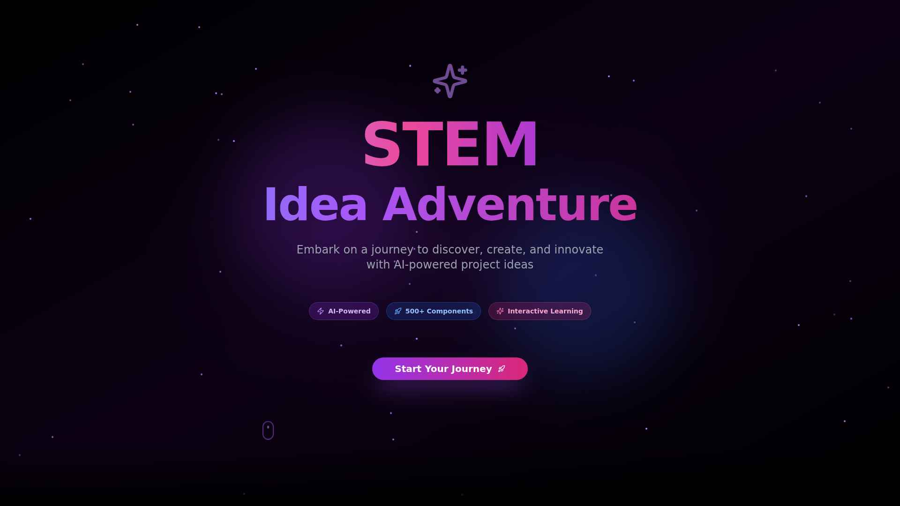
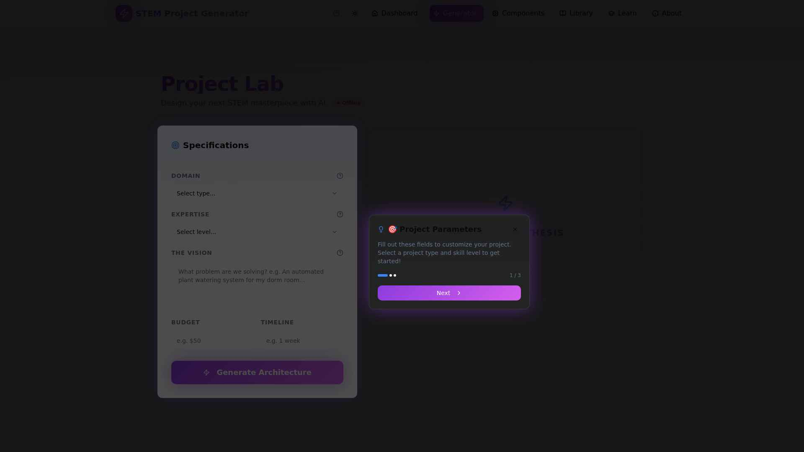
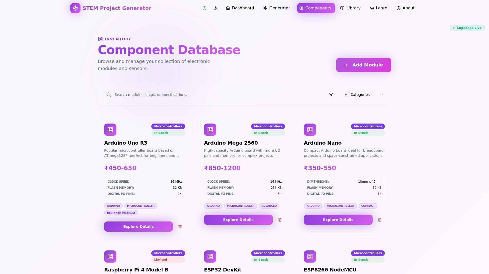
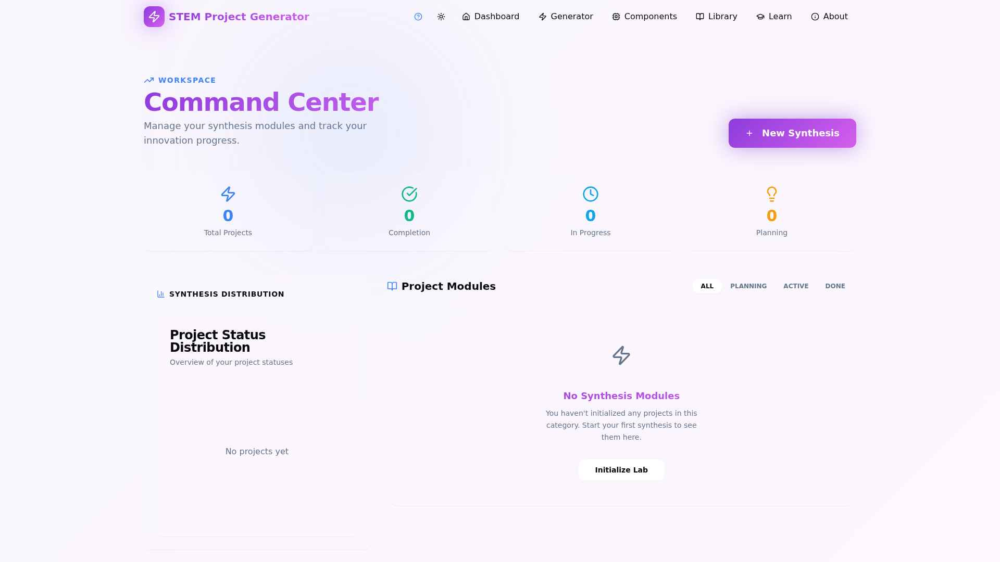
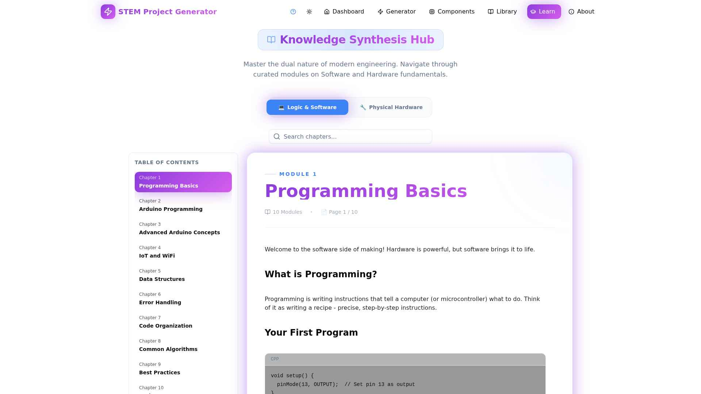

<div align="center">

# 🚀 STEM Idea Adventure 

### *Embark on a journey to discover, create, and innovate with AI-powered project ideas*  

[](https://perfection-v4.vercel.app)
[](LICENSE)
[](https://reactjs.org/)
[](https://fastapi.tiangolo.com/)


 
**An immersive 3D platform combining AI intelligence with stunning visuals to revolutionize STEM education**

[✨ Features](#-features) • [🎬 Screenshots](#-screenshots) • [🚀 Quick Start](#-quick-start) • [📚 Documentation](#-api-documentation) • [🤝 Contributing](#-contributing)

</div>

---

## 🌟 What Makes Us Special

STEM Idea Adventure isn't just another project generator—it's an **immersive experience** that combines cutting-edge AI with breathtaking 3D visuals to inspire creativity and innovation. Whether you're a student exploring robotics, an educator planning lessons, or a maker bringing ideas to life, we've got you covered.

### 🎯 Why Choose STEM Idea Adventure?

- **🤖 AI-Powered Intelligence**: Advanced AI that understands your vision and creates tailored project roadmaps
- **🎨 Stunning 3D Graphics**: Immersive particle effects and interactive 3D component visualizations
- **🎤 Voice Control**: Natural conversation with AI assistant via voice commands
- **💬 Smart Chat System**: Context-aware AI guidance that remembers your preferences
- **📦 500+ Components**: Comprehensive catalog with 3D previews and technical specs
- **🎓 Interactive Learning**: Digital book experience with visual learning materials
- **📊 Smart Tracking**: Automatic progress calculation based on completed tasks
- **🎨 7 Beautiful Themes**: Customize your experience with stunning color palettes

---

## ✨ Features

### 🤖 **AI Intelligence Hub**

<table>
<tr>
<td width="50%">

#### 💬 Universal Chat Assistant
- **Natural Conversations**: Talk to AI like a friend
- **Context Memory**: Remembers your project preferences
- **Smart Suggestions**: Proactive guidance and tips
- **Multi-Turn Dialogue**: Complex queries across messages
- **Powered by**: OpenRouter Solar Pro 3 AI

</td>
<td width="50%">

#### 🎤 Voice Command System
- **Hands-Free Operation**: Voice-activated commands
- **Speech Recognition**: Advanced voice-to-text
- **Natural Language**: "Create a robotics project"
- **Smart Navigation**: "Go to components catalog"
- **Voice Feedback**: Text-to-speech responses

</td>
</tr>
<tr>
<td width="50%">

#### 🎯 Project Generation
- **AI-Designed Projects**: Custom STEM ideas
- **Complete Roadmaps**: Step-by-step guides
- **Bill of Materials**: Component lists with specs
- **Budget Planning**: Cost estimates and timelines
- **Skill Matching**: Projects for your level

</td>
<td width="50%">

#### 📈 Smart Guidance
- **Real-Time Help**: Instant assistance
- **Progress Insights**: Completion tracking
- **Blocker Detection**: Identifies challenges
- **Resource Links**: Relevant tutorials
- **Best Practices**: Expert recommendations

</td>
</tr>
</table>

### 🎨 **Immersive 3D Experience**

<table>
<tr>
<td width="33%">

#### ✨ **Next-Gen Particles**
- 🔮 Circular glow particles
- 🎨 Theme-aware colors
- ⚡ 5000+ particles on high-end
- 💨 Dynamic animations
- 🌐 Universal coverage

</td>
<td width="33%">

#### 🎭 **Interactive 3D**
- 🔄 Component rotation
- 📦 Real-time rendering
- 🎬 Smooth transitions
- 💎 GPU acceleration
- 🖼️ WebGL effects

</td>
<td width="33%">

#### ⚙️ **Smart Adaptation**
- 📱 Device detection
- 🎮 Auto-optimization
- 🔋 Battery-aware
- 🌈 Quality levels
- ♿ Reduced motion

</td>
</tr>
</table>

### 📚 **Comprehensive Component Library**

| Feature | Description |
|---------|-------------|
| 📦 **500+ Components** | Arduino, Raspberry Pi, sensors, motors, LEDs, and more |
| 🔍 **Smart Search** | Filter by category, price, availability, and rating |
| 🎨 **3D Previews** | Interactive 3D models you can rotate and zoom |
| 📊 **Detailed Specs** | Technical specifications, datasheets, tutorials |
| ⭐ **User Reviews** | Community ratings and feedback |
| 🔗 **Related Projects** | See components used in real projects |
| 💡 **Alternatives** | Find similar components and substitutes |
| 📈 **Price Comparison** | Best deals and supplier links |

### 🎓 **Interactive Learning Hub**

```
📖 20+ Comprehensive Chapters
├── 💻 Software Fundamentals
│   ├── Programming Basics
│   ├── Arduino IDE
│   ├── Python for Robotics
│   └── Web Development
│
├── 🔧 Hardware Essentials
│   ├── Electronics 101
│   ├── Circuit Design
│   ├── Sensors & Actuators
│   └── PCB Design
│
└── 🤖 Advanced Topics
    ├── IoT & Connectivity
    ├── Machine Learning
    ├── Computer Vision
    └── Robotics Control
```

### 🎯 **Project Management**

- ✅ **Visual Progress Bars**: Real-time completion tracking
- 📋 **Step Checklist**: Check off tasks as you complete them
- 📊 **Auto-Calculation**: Progress = (completed steps / total steps) × 100
- 🎨 **Status Management**: Planning → In Progress → Completed → Archived
- 💾 **Cloud Sync**: All data saved automatically via Supabase
- 📤 **Export Options**: Share projects or download data
- 🔔 **Smart Notifications**: Toast messages for updates

### 🎨 **Premium Design System**

<table>
<tr>
<td align="center" width="14.28%">
<br/>
<b>Purple Fusion</b><br/>
#a855f7
</td>
<td align="center" width="14.28%">
<br/>
<b>Pink Blossom</b><br/>
#ec4899
</td>
<td align="center" width="14.28%">
<br/>
<b>Ocean Blue</b><br/>
#3b82f6
</td>
<td align="center" width="14.28%">
<br/>
<b>Matrix Green</b><br/>
#10b981
</td>
<td align="center" width="14.28%">
<br/>
<b>Cyber Red</b><br/>
#ef4444
</td>
<td align="center" width="14.28%">
<br/>
<b>Sunset Orange</b><br/>
#f97316
</td>
<td align="center" width="14.28%">
<br/>
<b>Charcoal Gray</b><br/>
#a3a3a3
</td>
</tr>
</table>

**UI/UX Features:**
- 🌙 Dark mode optimized
- 💎 Glass morphism effects
- 🎭 Smooth animations & transitions
- 📱 Fully responsive design
- ⚡ Fast page loads
- ♿ Accessibility compliant

---

## 🎬 Screenshots

<div align="center">

### 🏠 Hero Section with 3D Particles


*Immersive 3D particle field with theme-aware colors*

---

### 🎨 Project Generator with AI


*AI-powered project creation with elegant loading animations and beautifully formatted output*

**Note:** Screenshots show the improved UI with cool loading effects during generation and formatted project display. No raw JSON is visible to users.

---

### 📦 Interactive Component Library


*500+ components with 3D previews and detailed specifications*

---

### 📊 Smart Dashboard


*Visual progress tracking with analytics and insights*

---

### 🎓 Interactive Learning Hub


*Digital book experience with immersive 3D visualizations*

</div>

---

## 🛠 Technology Stack

<div align="center">

### Frontend Technologies

| Category | Technologies |
|----------|--------------|
| **Framework** |   |
| **3D Graphics** |   |
| **Styling** |   |
| **Build Tool** |  |
| **State** |  |

### Backend Technologies

| Category | Technologies |
|----------|--------------|
| **Framework** |   |
| **AI/ML** |  |
| **Database** |  |
| **Server** |  |

### Development Tools


</div>

### 🎮 Performance Features

```typescript
// Intelligent Device Detection
const deviceCapability = {
  cpu: navigator.hardwareConcurrency,      // 4+ cores
  memory: navigator.deviceMemory,          // 8GB+ RAM
  gpu: gl.getParameter(gl.RENDERER),       // WebGL info
  network: navigator.connection.type,      // 4G/5G
  screen: window.screen.width              // 1920x1080+
}

// Adaptive Quality Levels
HIGH    (80+): 5000 particles, shadows, post-processing
MEDIUM  (60-79): 2000 particles, shadows, standard rendering
LOW     (40-59): 1000 particles, basic rendering
MINIMAL (<40): 500 particles, 2D fallback
```

---

## 🚀 Quick Start

### 📋 Prerequisites

Before you begin, ensure you have:

- **Node.js** 18.0+ ([Download](https://nodejs.org/))
- **Python** 3.11+ ([Download](https://www.python.org/))
- **Git** ([Download](https://git-scm.com/))
- **OpenRouter API Key** ([Get Free Key](https://openrouter.ai/))
- **Supabase Account** ([Sign Up Free](https://supabase.com/))

### ⚡ Installation

```bash
# 1️⃣ Clone the repository
git clone https://github.com/HardikBhaskar2010/STEM-IDEA-GENERATOR.git
cd STEM-IDEA-GENERATOR

# 2️⃣ Set up backend
cd backend
pip install -r requirements.txt

# Create backend/.env
cat > .env << EOF
OPENROUTER_API_KEY=your_openrouter_api_key_here
SUPABASE_URL=your_supabase_url
SUPABASE_KEY=your_supabase_key
LOG_LEVEL=INFO
ENABLE_OPENROUTER=true
EOF

# 3️⃣ Set up frontend
cd ../frontend
yarn install

# Create frontend/.env
cat > .env << EOF
VITE_SUPABASE_URL=your_supabase_url
VITE_SUPABASE_ANON_KEY=your_supabase_anon_key
VITE_API_BASE_URL=http://localhost:8001/api
EOF

# 4️⃣ Set up database
# Copy and run master_supabase_schema.sql in your Supabase SQL Editor
# This creates all tables, indexes, RLS policies, and sample data

# 5️⃣ Start development servers
# Terminal 1 - Backend
cd backend
python server.py

# Terminal 2 - Frontend
cd frontend
yarn dev
```

### 🌐 Access the Application

- **Frontend**: http://localhost:3000
- **Backend API**: http://localhost:8001
- **API Docs**: http://localhost:8001/docs

---

## 📚 API Documentation

### 🔌 Core Endpoints

#### Health & Status
```http
GET /api/health
```
Returns system health including OpenRouter connectivity status

#### AI Project Generation
```http
POST /api/generate-project
Content-Type: application/json

{
  "projectType": "robotics",
  "skillLevel": "intermediate",
  "interests": "autonomous navigation",
  "budget": "$150",
  "duration": "6 weeks"
}
```

**Response:**
```json
{
  "title": "Autonomous Line-Following Robot",
  "description": "Build a smart robot that navigates using infrared sensors...",
  "difficulty": "Intermediate",
  "estimatedTime": "6 weeks",
  "estimatedCost": "$120-180",
  "components": [
    "Arduino Uno R3",
    "L298N Motor Driver",
    "IR Sensors (5x)",
    "DC Motors (2x)",
    "Chassis Kit"
  ],
  "skills": [
    "Arduino Programming",
    "Motor Control",
    "Sensor Integration",
    "PID Control"
  ],
  "steps": [
    "Assemble robot chassis and mount motors",
    "Wire motor driver to Arduino",
    "Install and calibrate IR sensors",
    "Program basic movement functions",
    "Implement line detection algorithm",
    "Add PID control for smooth tracking",
    "Test and optimize performance"
  ]
}
```

#### AI Voice Processing
```http
POST /api/ai-guidance/process-voice
Content-Type: application/json

{
  "transcript": "help me create a robotics project",
  "timestamp": "2026-01-27T12:00:00Z",
  "context": {}
}
```

**Response:**
```json
{
  "text": "I'd love to help! What type of robot interests you?",
  "action": "collect_info",
  "parameters": null,
  "needs_more_info": true,
  "conversation_context": {
    "intent": "create_project",
    "project_details": {}
  }
}
```

#### Component Details
```http
GET /api/components/{component_id}/details
```

Returns detailed component information including specs, reviews, and related projects.

### 🎤 Voice Commands

The AI assistant understands natural language commands:

| Command | Action |
|---------|--------|
| "Hello" / "Hi" | Get welcome message and available commands |
| "Help me create a robotics project" | Start project creation flow |
| "Go to dashboard" | Navigate to dashboard page |
| "Show my projects" | Navigate to library |
| "Open components" | Navigate to component catalog |
| "How do I use this app?" | Get app usage guide |

---

## 🎮 Usage Guide

### 💬 Using the AI Chat

1. **Open Chat**: Press `Ctrl+K` or click the AI Assistant button
2. **Type Message**: Enter your question or request
3. **Voice Input**: Click the microphone icon for voice commands
4. **Get Response**: AI provides contextual help and suggestions

### 🎨 Creating a Project

1. Navigate to **Project Lab** (Generator page)
2. Select your **Domain** (Robotics, IoT, Electronics, etc.)
3. Choose **Skill Level** (Beginner to Expert)
4. Describe **Your Vision** in "The Vision" field
5. Set **Budget** and **Timeline** (optional)
6. Click **Generate Architecture**
7. Review the AI-generated project
8. Click **Save Lab** to add to your library

### 📊 Tracking Progress

1. Open any saved project from your Library
2. Check off completed steps by clicking checkboxes
3. Progress bar updates automatically
4. See completion percentage: `(completed / total) × 100`

### 🔍 Browsing Components

1. Go to **Components Catalog**
2. Use search bar or filters
3. Click any component for details
4. View 3D model (rotate and zoom)
5. Read specs, reviews, and related projects

---

## 📁 Project Structure

```
STEM-IDEA-GENERATOR/
│
├── 🔧 backend/                      # FastAPI Backend
│   ├── server.py                   # Main server with all endpoints
│   ├── services/                   # Business logic services
│   │   ├── aiGuidanceService.py   # AI chat and voice processing
│   │   └── projectService.py      # Project generation logic
│   ├── models/                     # Data models and schemas
│   ├── requirements.txt            # Python dependencies
│   └── .env                        # Backend configuration
│
├── ⚛️ frontend/                     # React Frontend
│   ├── src/
│   │   ├── 🎨 components/          # React components
│   │   │   ├── three/             # Three.js 3D components
│   │   │   │   ├── ParticleField.tsx        # Particle system
│   │   │   │   ├── FloatingGeometry.tsx     # 3D shapes
│   │   │   │   ├── HeroScene3D.tsx          # Hero animations
│   │   │   │   ├── Component3DViewer.tsx    # Component 3D
│   │   │   │   └── BackgroundCanvas3D.tsx   # Background 3D
│   │   │   ├── UniversalChat.tsx           # AI chat interface
│   │   │   ├── VoiceCommand.tsx            # Voice controls
│   │   │   └── ui/                         # UI components
│   │   │
│   │   ├── 📄 pages/               # Application pages
│   │   │   ├── Home.tsx           # Landing page
│   │   │   ├── Dashboard.tsx      # User dashboard
│   │   │   ├── Generator.tsx      # Project generator
│   │   │   ├── Components.tsx     # Component catalog
│   │   │   ├── Library.tsx        # Project library
│   │   │   └── Learn.tsx          # Learning hub
│   │   │
│   │   ├── 🔌 services/            # API services
│   │   │   ├── apiService.ts      # API client
│   │   │   ├── aiVoiceService.ts  # Voice processing
│   │   │   └── supabaseClient.ts  # Database client
│   │   │
│   │   ├── 🎯 contexts/            # React contexts
│   │   │   ├── ThreeDContext.tsx  # 3D capability
│   │   │   ├── AuthContext.tsx    # Authentication
│   │   │   └── PreferencesContext.tsx  # User settings
│   │   │
│   │   ├── 🪝 hooks/               # Custom hooks
│   │   ├── 📚 lib/                 # Utilities
│   │   │   ├── deviceCapability.ts  # Device detection
│   │   │   └── utils.ts            # Helper functions
│   │   │
│   │   └── 🎨 types/               # TypeScript types
│   │
│   ├── public/                     # Static assets
│   ├── package.json                # Dependencies
│   ├── vite.config.ts             # Vite configuration
│   └── .env                        # Frontend configuration
│
├── 📸 screenshots/                  # Application screenshots
├── 📄 README.md                     # This file
└── 📜 LICENSE                       # MIT License
```

---

## 🎯 Performance Optimization

### Device Capability Detection

The app automatically detects your device's capabilities:

```javascript
// Metrics Used
✅ CPU Cores (hardwareConcurrency)
✅ Device Memory (RAM)
✅ GPU Vendor & Renderer
✅ Network Speed
✅ Screen Resolution
✅ Touch Support

// Quality Levels Assigned
HIGH    → 5000 particles, full effects, shadows, post-processing
MEDIUM  → 2000 particles, standard rendering, shadows
LOW     → 1000 particles, basic rendering
MINIMAL → 500 particles, 2D fallback
```

### Recommended Hardware

| Level | CPU | GPU | RAM | Display |
|-------|-----|-----|-----|---------|
| **High** | 8+ cores | Dedicated GPU | 8GB+ | 1920x1080+ |
| **Medium** | 4+ cores | Integrated GPU | 4GB+ | 1280x720+ |
| **Low** | 2+ cores | Basic GPU | 2GB+ | Any |

### Browser Compatibility

| Browser | Version | Performance | Notes |
|---------|---------|-------------|-------|
| Chrome | 90+ | ⭐⭐⭐⭐⭐ | Best performance |
| Firefox | 88+ | ⭐⭐⭐⭐ | Excellent |
| Safari | 14+ | ⭐⭐⭐⭐ | Great on Mac/iOS |
| Edge | 90+ | ⭐⭐⭐⭐⭐ | Chromium-based |

### Troubleshooting

**Performance Issues?**
1. ✅ Enable hardware acceleration in browser settings
2. ✅ Update graphics drivers to latest version
3. ✅ Close unnecessary browser tabs
4. ✅ Disable heavy browser extensions
5. ✅ Check console for detected capability level

**3D Not Working?**
1. ✅ Ensure WebGL is enabled
2. ✅ Try a different browser
3. ✅ Update to latest browser version
4. ✅ Check GPU compatibility

---

## 🚀 Deployment

### Frontend (Vercel / Netlify)

```bash
# Build Command
yarn build

# Output Directory
dist

# Environment Variables
VITE_SUPABASE_URL=https://your-project.supabase.co
VITE_SUPABASE_ANON_KEY=your_supabase_anon_key
VITE_API_BASE_URL=https://your-backend.onrender.com/api
```

### Backend (Render / Railway)

```bash
# Start Command
uvicorn server:app --host 0.0.0.0 --port $PORT

# Environment Variables
OPENROUTER_API_KEY=your_openrouter_key
SUPABASE_URL=https://your-project.supabase.co
SUPABASE_KEY=your_supabase_service_key
LOG_LEVEL=INFO
ENABLE_OPENROUTER=true
```

### Supabase Setup

1. Create new project at [supabase.com](https://supabase.com)
2. Copy project URL and anon key
3. Go to SQL Editor
4. Paste and execute `master_supabase_schema.sql`
5. Verify tables created successfully

---

## 🤝 Contributing

We love contributions! Here's how you can help:

### 🐛 Found a Bug?

1. Check if it's already reported in [Issues](https://github.com/HardikBhaskar2010/STEM-IDEA-GENERATOR/issues)
2. Create a new issue with detailed description
3. Include steps to reproduce
4. Add screenshots if applicable

### 💡 Have an Idea?

1. Open an issue with `enhancement` label
2. Describe the feature and its benefits
3. Discuss implementation approach

### 🔧 Want to Code?

```bash
# 1. Fork the repository
# 2. Create feature branch
git checkout -b feature/amazing-feature

# 3. Make your changes
# 4. Test thoroughly (especially 3D features)
# 5. Commit with descriptive message
git commit -m 'Add amazing feature'

# 6. Push to your fork
git push origin feature/amazing-feature

# 7. Open Pull Request
```

### ✅ Code Standards

- Follow TypeScript/JavaScript best practices
- Add JSDoc comments for functions
- Test on multiple devices and browsers
- Ensure 3D features work across capability levels
- Keep performance in mind (lazy loading, code splitting)
- Follow existing code style and structure

---

## 📄 License

This project is licensed under the **MIT License** - see the [LICENSE](LICENSE) file for details.

### What This Means

✅ Commercial use  
✅ Modification  
✅ Distribution  
✅ Private use  

❌ Liability  
❌ Warranty  

---

## 🙏 Acknowledgments

<table>
<tr>
<td align="center" width="25%">
<br/>
<b>Three.js</b><br/>
<sub>3D Graphics Magic</sub>
</td>
<td align="center" width="25%">
<br/>
<b>OpenRouter</b><br/>
<sub>AI Intelligence</sub>
</td>
<td align="center" width="25%">
<br/>
<b>Supabase</b><br/>
<sub>Backend Power</sub>
</td>
<td align="center" width="25%">
<br/>
<b>shadcn/ui</b><br/>
<sub>Beautiful UI</sub>
</td>
</tr>
</table>

**Special Thanks To:**
- React Three Fiber team for amazing 3D React integration
- Vite team for blazing-fast build tool
- FastAPI for high-performance Python framework
- Tailwind CSS for utility-first styling
- The open-source community ❤️

---

## 📞 Contact & Links

<div align="center">

### 👨‍💻 Developer

**Hardik Bhaskar** *(Luna Kitsune)*

[](mailto:hardik.bhaskar2010@gmail.com)
[](https://github.com/HardikBhaskar2010)

### 🔗 Project Links

[](https://perfection-v4.vercel.app)
[](https://github.com/HardikBhaskar2010/STEM-IDEA-GENERATOR)
[](https://perfection-v2.onrender.com/docs)

</div>

---

## 🗺️ Roadmap

### 🚀 Coming Soon (v3.0)

- [ ] **WebXR Support** - VR/AR experiences with Meta Quest & Apple Vision Pro
- [ ] **Real-Time Collaboration** - Work on projects with friends in real-time
- [ ] **Advanced Physics** - Realistic simulations for testing designs
- [ ] **AI Model Generator** - Generate 3D models from text descriptions
- [ ] **Mobile Apps** - Native iOS & Android apps with offline support
- [ ] **Custom Shaders** - Advanced visual effects and materials
- [ ] **Component Marketplace** - Buy/sell custom components
- [ ] **Social Features** - Follow makers, share projects, get inspired
- [ ] **Video Tutorials** - Step-by-step video guides for projects
- [ ] **Gamification** - Earn badges, unlock achievements, level up

### 💭 Future Ideas

- [ ] Live coding playground with real-time preview
- [ ] Integration with 3D printers and CNC machines
- [ ] AI-powered debugging assistant
- [ ] Cloud-based Arduino/ESP32 simulator
- [ ] Virtual maker space with video chat
- [ ] Project funding and crowdfunding integration
- [ ] Professional certification programs
- [ ] Corporate team collaboration tools

---

## 📝 Changelog

### ✨ Version 2.2 - Enhanced Project Generator UX (January 2026)

#### 🎨 UI/UX Improvements
- ✨ **Cool Loading Animation**: Beautiful animated loading state during project generation
  - Spinning sparkles icon with gradient circle
  - 3 orbiting particles in theme colors
  - Bouncing progress dots
  - Pulsing gradient bars
  - Ambient glow effect
- 🚫 **No Raw JSON Display**: Eliminated confusing raw JSON text during streaming
- 📊 **Formatted Output**: Beautifully structured project display with badges, cards, and sections
- 💫 **Smooth Transitions**: Professional animations between loading and result states
- 🎯 **Clear Status**: "AI is Synthesizing Your Project" message with helpful description

#### 🔧 Technical Improvements
- ✅ Improved StreamingResponse component
- ✅ Better state management for streaming vs completed states
- ✅ CSS-based animations for optimal performance
- ✅ Responsive design maintained
- ✅ Dark theme compatibility ensured

### 🎉 Version 2.1 - AI Voice & Chat Integration (January 2026)

#### 🤖 AI Features
- ✨ **Universal Chat System**: Context-aware AI assistant with conversation memory
- 🎤 **Voice Commands**: Natural language voice control with speech recognition
- 💬 **Smart Responses**: AI understands project creation, navigation, and help requests
- 🔊 **Text-to-Speech**: AI can speak responses back to you
- 🧠 **Context Persistence**: Chat remembers your preferences across sessions

#### 🔧 Technical Improvements
- ✅ Fixed Vite proxy configuration (port 8000 → 8001)
- ✅ Updated environment variables for local development
- ✅ Added debug logging for API calls
- ✅ Improved error handling in voice service
- ✅ Enhanced API endpoint routing with `/api` prefix

### 🎨 Version 2.0 - Enhanced 3D Experience (January 2026)

#### Visual Enhancements
- ✨ Circular particles with radial glow effects
- 🎨 7 theme-aware color palettes
- ⚡ 5000+ particles on high-end devices
- 💨 3x faster animations with dynamic effects
- 🌐 Universal particle coverage on all pages

#### Database & Backend
- ✅ Production-ready SQL schema with `pgcrypto`
- 📊 Optimized indexes for better performance
- 🔐 Simplified Row Level Security policies
- 📦 Sample data with 18+ components

### 🚀 Version 1.0 - Initial Release

- 🎨 Immersive 3D particle effects
- 🤖 AI-powered project generation
- 📚 500+ electronic components catalog
- 🎓 Interactive learning hub
- 📊 Automatic progress tracking
- 🎨 Dark theme with purple accents
- 📱 Responsive design for all devices

---

<div align="center">

## 💫 Built with Passion


### *Empowering the next generation of makers and innovators*

**🌟 If you found this project helpful, please consider giving it a star!**

[](https://github.com/HardikBhaskar2010/STEM-IDEA-GENERATOR)

---

*Made with ☕ and 💜 in India*

</div>
